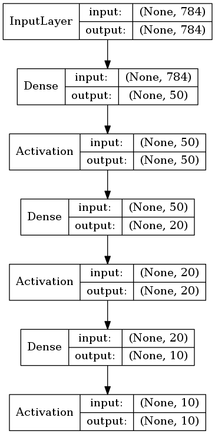

# 1 学習済みモデルの保存と再利用

ここでは学習済みのモデルを保存する方法を見てみましょう。学習済みのモデルを保存することで、学習したモデルを推論用途に利用したり、モデルのアーキテクチャや重みを取り出して転移学習に利用したり、新たなデータを用意してモデルを訓練し直したり、様々な用途に利用できます。

ここではモデルの保存を確認するために次のようなMNISTデータを学習するプログラムを用意しておきましょう。

```python
from keras.models import Sequential
from keras.layers import Dense, Activation
from keras.utils import to_categorical
from keras.datasets import mnist

(x_train, y_train), (x_test, y_test) = mnist.load_data()

x_train = x_train.reshape(60000, 784)
x_test = x_test.reshape(10000, 784)

y_train = to_categorical(y_train, 10)
y_test = to_categorical(y_test, 10)

model = Sequential()
model.add(Dense(50, input_dim=784))
model.add(Activation('sigmoid'))
model.add(Dense(20))
model.add(Activation('sigmoid'))
model.add(Dense(10))
model.add(Activation('softmax'))
model.compile(optimizer='sgd', loss='categorical_crossentropy',
              metrics=['accuracy'])

history = model.fit(x_train, y_train, batch_size=64, epochs=3)
```

プログラムを実行すると次のように表示されるでしょう。

```
Epoch 1/3
60000/60000 2s - loss: 1.9841 - acc: 0.5121     
Epoch 2/3
60000/60000 2s - loss: 1.4617 - acc: 0.7251     
Epoch 3/3
60000/60000 2s - loss: 1.0904 - acc: 0.8000     
```

この時点で変数modelは訓練データに対して80%程度学習できているのがわかります。

<div style="page-break-before:always"></div>

## 1.1 モデルの保存

Kerasの学習済みのモデルはHDF5形式のファイルに保存することができます。

> HDF（Hierarchical Data Format）とは階層データフォーマットという意味です。大量のデータを階層化して保存する際に利用されます。

HDF5形式のファイルには以下の内容が保存されます。

+ モデルの構造
+ モデルの重み
+ 学習時の設定 (損失関数，オプティマイザ)
+ オプティマイザの状態（学習を終えた時点から学習を再開可能）

> Kerasのモデルの保存にpickleやcPickleを使うことは推奨されていません。

具体的には次のように実行します。

```python
# 変数modelは学習済みのモデル

model.save('my_model.h5')
```

<div style="page-break-before:always"></div>

## 1.2 モデルの読み込み

HDF5形式のファイルに保存したモデルはload_modelメソッドによって再利用することができます。

```python
from keras.datasets import mnist
from keras.models import load_model
from keras.utils import to_categorical

model = load_model('my_model.h5')

(x_train, y_train), (x_test, y_test) = mnist.load_data()

x_train = x_train.reshape(60000, 784)
x_test = x_test.reshape(10000, 784)

y_train = to_categorical(y_train, 10)
y_test = to_categorical(y_test, 10)

history = model.fit(x_train, y_train, batch_size=64, epochs=3)
```

プログラムの実行結果は次のようになるでしょう。

```
Epoch 1/3
60000/60000 2s - loss: 0.8424 - acc: 0.8482     
Epoch 2/3
60000/60000 2s - loss: 0.6813 - acc: 0.8711     
Epoch 3/3
60000/60000 2s - loss: 0.5777 - acc: 0.8820     
```

前回保存した学習モデル（my_model.h5）を利用しているので、1回目のエポックから84%と高い正答率（acc）になっているのがわかります。

<div style="page-break-before:always"></div>


## 1.3 モデルアーキテクチャの保存

モデルのアーキテクチャ（学習モデルから重みや設定を除いたもの）を保存することもできます。モデルのアーキテクチャはJSON形式、YAML形式で出力できるので、結果をファイルに保存できます。次のプログラムはJSON形式でモデルのアーキテクチャを出力します。


```python
# 変数modelは学習済みのモデル

json_string = model.to_json()
f = open("my_model_arch.json", "w")
f.write(json_string)
f.close()
```

プログラムを実行するとmy_model_arch.jsonファイルが生成されるでしょう。

> YAML形式で出力する場合は yaml_string = model.to_yaml() とします。

また保存したモデルアーキテクチャはmodel_from_jsonメソッド、model_from_yamlメソッドで再利用することができます。次のプログラムはJSON形式の文字列からモデルを生成します。

```python
from keras.models import model_from_json

f = open("my_model_arch.json", "r")
json_string = f.read()
f.close()

model2 = model_from_json(json_string)
print(len(model2.layers))
```

プログラムを実行するとモデルのレイヤー数 6 が出力されるでしょう。

> YAMLの場合はmodel_from_yamlメソッドを使います。

<div style="page-break-before:always"></div>

## 1.4 モデルの重みの保存

学習済みのモデルから、モデルの重みのみ保存する場合はモデルに対してsave_weightsメソッドを呼び出します。

```python
# 変数modelは学習済みのモデル

model.save_weights('my_model_weights.h5')
```

ファイルからモデルの重みをロードするにはモデルに対してload_weightsメソッドを呼び出します。

```python
# 変数modelはModelインスタンス

model.load_weights('my_model_weights.h5')
```

> model.load_weights('my_model_weights.h5', by_name=True) とすれば、レイヤーの名前を指定して重みパラメータをロードすることもできます。このような仕組みは転移学習に利用することもできます。

さいごにモデルアーキテクチャをロードした後、重みをロードするプログラムを見てみましょう。

```python
from keras.datasets import mnist
from keras.utils import to_categorical
from keras.models import model_from_json

f = open("my_model_arch.json", "r")
json_string = f.read()
f.close()

model = model_from_json(json_string)
model.load_weights('my_model_weights.h5')
model.compile(optimizer='sgd', loss='categorical_crossentropy',
              metrics=['accuracy'])

(x_train, y_train), (x_test, y_test) = mnist.load_data()

x_train = x_train.reshape(60000, 784)
x_test = x_test.reshape(10000, 784)

y_train = to_categorical(y_train, 10)
y_test = to_categorical(y_test, 10)

history = model.fit(x_train, y_train, batch_size=64, epochs=3)
```

この場合、アーキテクチャと重みは再利用できますが、model.compileメソッドによって損失関数やオプティマイザを別途指定する必要があります。

プログラムの実行結果は次のようになるでしょう。

```
Epoch 1/3
60000/60000 2s - loss: 0.5102 - acc: 0.8900     
Epoch 2/3
60000/60000 2s - loss: 0.4607 - acc: 0.8966     
Epoch 3/3
60000/60000 2s - loss: 0.4294 - acc: 0.8996     
```

前回保存した学習モデルの重み（my_model_weights.h5）を利用しているので、1回目のエポックから89%と高い正答率（acc）になっているのがわかります。

<div style="page-break-before:always"></div>

## 1.5 モデルの可視化

Kerasのユーティリティ（plot_modelメソッド）を使えばモデルアーキテクチャを可視化することもできます。

```python
from keras.utils import plot_model

# 変数modelは学習済みのモデル
plot_model(model, to_file='model.png', show_shapes=True, show_layer_names=False)
```


