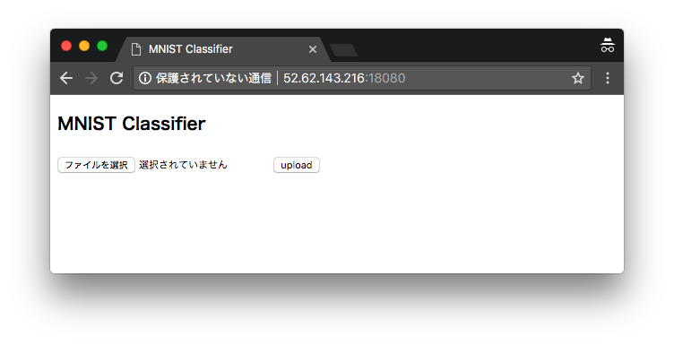
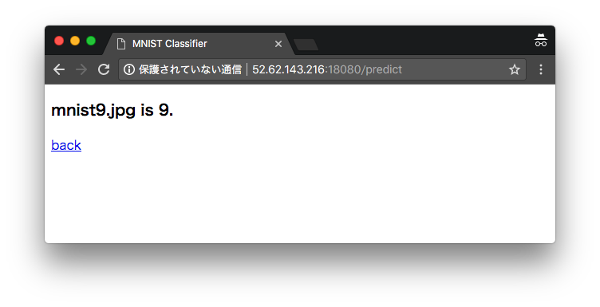
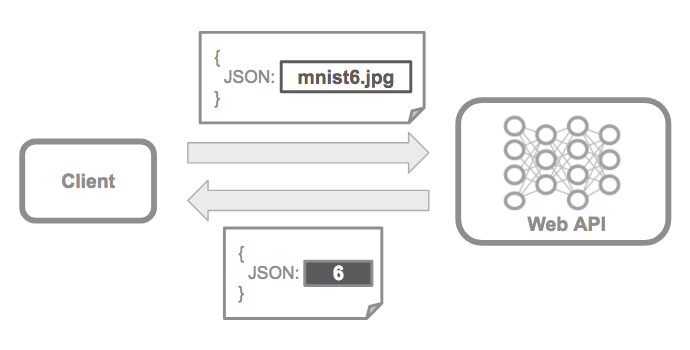

# 3 アプリケーションへの組み込み

それでは学習済みモデルを活用する簡単なアプリケーションを開発してみましょう。ここでは簡単なコンソールアプリケーションとWebアプリケーションの2つの実装方法を取り上げます。

## 3.1 コンソールアプリケーションへの組み込み

コマンドラインで利用できるPythonアプリケーション（my_cli_app.py）を開発します。また学習済みのモデルをラップするMNISTClassfierクラス（my_classfier.py）を作成します。

このアプリケーションはコマンドラインから次のように利用します。

```
python my_cli_app.py mnist6.jpg
```

> コマンドライン引数に推論対象となるファイル名を受け取ります。


<div style="page-break-before:always"></div>

### MNISTClassfierクラス（my_classfier.py）の実装

MNISTデータを学習済みのモデルをラップするMNISTClassfierを実装します。

+ MNISTClassfierクラス
  + コンストラクタ
    + モデルファイル名を受け取る
  + predictメソッド
    + 引数で画像ファイル名を受け取る
    + 分類結果（0〜9）を戻り値として返す

```python
import numpy as np
from keras.models import load_model
from keras.preprocessing.image import load_img, img_to_array

class MNISTClassfier:
    def __init__(self, model_name):
        self.model = load_model(model_name)

    def predict(self, file):
        img = img_to_array(load_img(file, target_size=(28, 28), grayscale=True))
        img = img.astype('float32')
        img /= 255
        return self.model.predict_classes(np.array([img]), verbose=0)[0]
```

MNISTClassfierクラスはコンストラクタでモデルファイル名（"my_trained_model.h5"）を受け取ります。また引数で受け取ったファイルを推論するpredictメソッドを実装しています。

<div style="page-break-before:always"></div>

### コマンドラインアプリケーション（my_cli_app.py）の実装

続いてコマンドラインアプリケーション（my_cli_app.py）を実装します。コマンドラインアプリケーションは起動引数で画像ファイル名を受け取ります。MNISTClassfierインスタンスを生成し画像の分類を行い、分類結果を標準出力に出力します。


```python
import sys
from my_classfier import MNISTClassfier

def main():
    if len(sys.argv) != 2:
        print("Usage: python {} filename".format(sys.argv[0]))
        sys.exit(1)

    # file = "mnist1.jpg"
    file = sys.argv[1]

    clf = MNISTClassfier("my_trained_model.h5")
    result = clf.predict(file)
    print("{} is {}.".format(file, result))

if __name__ == "__main__":
    main()
```

上記のプログラムを実行すると次のように表示されるでしょう。

```
python my_cli_app.py mnist6.jpg
mnist6.jpg is 6.
```

<div style="page-break-before:always"></div>


## 3.2 Webアプリケーションへの組み込み

続いて簡単なWebアプリケーションに学習済みモデルを組み込んでみましょう。


ここではPythonの軽量WebフレームワークBottleを活用してWebアプリケーションをか発してみます。

### Bottle

Bottleはシンプルなマイクロフレームワークです。Pythonの標準ライブラリ以外に依存関係がないため簡単に導入することができます。BottleはURLのルーティングに加えて、ビューテンプレート、サーバー機能、HTTPの操作に必要な各種ユーティリティを提供します。

https://bottlepy.org/docs/dev/

まずはBottleを使った簡単なWebアプリケーション作成してみましょう。を次のプログラム（hello_bottle.py）はURLに指定されたパラメータを表示するものです。

```python
from bottle import route, run, template

@route('/hello/<name>')
def index(name):
    return template('<b>Hello {{name}}</b>!', name=name)

run(host='0.0.0.0', port=18080)
```

上記のプログラムを実行すると18080番ポートを使ってBottleのサーバプログラムが起動します。

```
python hello_bottle.py
Bottle v0.12.13 server starting up (using WSGIRefServer())...
Listening on http://0.0.0.0:18080/
Hit Ctrl-C to quit.
```

ブラウザから http://localhost:18080/hello/bottle アクセスすると次のような画面が表示されるでしょう。

> クラウド上で実行する場合はlocalhostの部分をIPアドレスに置き換えてください。

<div style="page-break-before:always"></div>

### 学習済みモデルの利用

アップロードされた画像を識別する簡単なWebアプリケーションを開発してみましょう。このアプリケーションはアップロード画面と、推論結果表示画面の2つで構成されています。

+ /
  + アップロード画面。推論対象となる画像ファイルを入力する。
+ /predict
  + 推論結果表示画面。アップロードされた画像ファイルの推論結果を表示する。


ここではカレントフォルダ上に以下のファイルを用意します。

+ my_web_app.py
  + Webアプリケーションの起動ファイル
+ my_classfier.py
  + MNIST分類器
+ my_trained_model.h5
  + 学習済みモデルデータ
+ index.tpl
  + アップロード画面用テンプレート
+ predict.tpl
  + 推論結果表示画面用テンプレート

> my_web_app.py、index.tpl、predict.tplの3つを順に作成していきます。

Webアプリケーションの起動ファイル（my_web_app.py）は次のようになります。

<div style="page-break-before:always"></div>

```python
import os
from io import BytesIO
from bottle import route, request, response, run, template
from my_classfier import MNISTClassfier

clf = MNISTClassfier("my_trained_model.h5")

@route("/")
def index():
    return template("index")

@route("/predict", method="POST")
def predict():
    try:
        upload = request.files.get("upload")
        if upload is None:
            raise Exception("File not uploaded.")

        name, ext = os.path.splitext(upload.filename)
        if ext not in (".png",".jpg",".jpeg"):
            raise Exception("File extension not allowed.")

        bytesio = BytesIO()
        upload.save(bytesio)
        result = clf.predict(bytesio)
        return template("predict", file=upload.filename, result=result)
    except Exception as e:
        return str(e)

run(host="0.0.0.0", port=18080)
```

> ここでは入力チェックや例外処理は簡易な実装としています。


上記のプログラムではアップロード画面と推論結果表示画面2つのルーティングを定義しています。アップロード画面を処理するindexメソッドでは、Bottleのテンプレート機能を利用して画面を表示しています。

推論結果表示画面のpredictメソッドでは、アップロードされた画像についての入力チェックを実行した後、画像のバイナリデータ（BytesIOオブジェクト）を生成し、MNISTClassfierのpredictメソッドの引数に指定して推論を行っています。

> BottleのAPIの詳細は割愛します。詳細はBottleのマニュアルを参照すると良いでしょう。 https://bottlepy.org/docs/dev/

<div style="page-break-before:always"></div>

続いてアップロード画面用テンプレート（index.tpl）を作成します。

```html
<!DOCTYPE html>
<html>
  <head>
    <meta charset="utf-8">
    <title>MNIST Classifier</title>
  </head>
  <body>
    <h3>MNIST Classifier</h3>
    <form method="post" action="/predict" enctype="multipart/form-data">
      <input type="file" name="upload">
      <input type="submit" value="upload">
    </form>
  </body>
</html>
```

同様に推論結果表示画面用テンプレート（predict.tpl）を作成します。

```html
<!DOCTYPE html>
<html>
  <head>
    <meta charset="utf-8">
    <title>MNIST Classifier</title>
  </head>
  <body>
    <h3>{{file}} is {{result}}.</h3>
    <a href="/">back</a>
  </body>
</html>
```

準備ができたらアプリケーションを起動してみましょう。

```python
python my_web_app.py
Bottle v0.12.13 server starting up (using WSGIRefServer())...
Listening on http://0.0.0.0:18080/
Hit Ctrl-C to quit.
```

> Ctrl-Cでサーバを停止できます。

ローカルでHTTPサーバが起動します。ブラウザから http://localhost:18080/ にアクセスすると次のようなアップロード画面が表示されるでしょう。



> クラウド上で実行する場合はlocalhostの部分をIPアドレスに置き換えてください。

アップロード画面で手書き数字画像（mnist9.jpgなど）を選択してアップロードしてみましょう。次のよう
な推論結果画面が表示されます。




<div style="page-break-before:always"></div>

### Web APIの実装

さきほどのWebアプリケーションはブラウザでアクセスするものでした。次はWeb APIとして実装してみましょう。



以下のURLにアクセスしたとき、JSONデータを返却するものとします。

+ /api/predict
  + 画像のアップロードAPI。POSTされたJSONデータ（画像データ）を処理する
  + 推論結果はコンテントタイプをapplication/jsonとして返却する
    + JSONデータにはファイル名と推論結果を格納して返却する

ここではmy_web_app.pyにJSONデータをやりとりするapi_predictメソッドを追加します。またWeb APIを利用するクライアントプログラムも作成します。

<div style="page-break-before:always"></div>

```python
import os
import sys
import base64
from io import BytesIO
from bottle import route, request, response, run, template
from my_classfier import MNISTClassfier

clf = MNISTClassfier("my_trained_model.h5")

@route("/")
def index():
    return template("index")

@route("/predict", method="POST")
def predict():
    try:
        upload = request.files.get("upload")
        if upload is None:
            raise Exception("File not uploaded.")

        name, ext = os.path.splitext(upload.filename)
        if ext not in (".png",".jpg",".jpeg"):
            raise Exception("File extension not allowed.")

        bytesio = BytesIO()
        upload.save(bytesio)
        result = clf.predict(bytesio)
        return template("predict", file=upload.filename, result=result)
    except Exception as e:
        return str(e)

@route("/api/predict", method="POST")
def api_predict():
    try:
        file_data = request.json["file_data"]
        if file_data is None:
            raise Exception("File not uploaded.")

        file = request.json["file"]
        if file is None:
            raise Exception("File not uploaded.")

        name, ext = os.path.splitext(file)
        if ext not in (".png",".jpg",".jpeg"):
            raise Exception("File extension not allowed.")

        bytesio = BytesIO()
        bytesio.write(base64.decodebytes(bytes(file_data, "UTF-8")))
        result = clf.predict(bytesio)
        response.content_type = "application/json"
        return {"file":  file, "result": str(result)}
    except Exception as e:
        return {"file": "invalid file", "result":  "-1"}

run(host="0.0.0.0", port=18080)
```

新たにapi_predictメソッドを実装しています。api_predictメソッドでは画像データをBase64デコードした後、推論処理を行っています。また戻り値をJSON形式で返却するのでdictオブジェクトを返却しています。

<div style="page-break-before:always"></div>

続いて上記のAPIの動作確認のために簡易なクライアントプログラム（my_api_client.py）を作成しましょう。


```python
import sys
import requests
import json
import base64

def main():
    if len(sys.argv) != 2:
        print("Usage: python {} filename".format(sys.argv[0]))
        sys.exit(1)

    # file = "mnist1.jpg"
    file = sys.argv[1]

    image = open(file, "rb")
    file_data = base64.encodebytes(image.read()).decode("utf-8")
    req_json = {"file": file, "file_data": file_data}

    url = "http://localhost:18080/api/predict"

    response = requests.post(url, json=req_json)
    res_json = json.loads(response.text)
    print("{} is {}".format(res_json["file"], res_json["result"]))

if __name__ == "__main__":
    main()
```


上記のクライアントプログラムはコマンドラインで受け取った画像ファイルをBase64エンコードした後、JSON形式でWeb APIにPOSTします。その後、返却されたAPIのレスポンス（推論結果）を出力します。

プログラムを作成したら再度サーバを起動してみましょう。

```python
python my_web_app.py
Bottle v0.12.13 server starting up (using WSGIRefServer())...
Listening on http://0.0.0.0:18080/
Hit Ctrl-C to quit.
```

それからクライアントプログラムを実行します。

```python
python my_api_client.py mnist6.jpg
```

クライアントプログラムは次のような結果を出力するでしょう。

```
mnist6.jpg is 6
```
