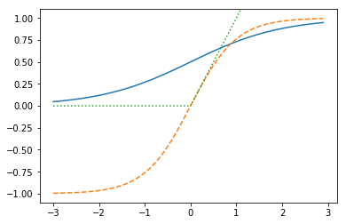

# 1 全結合型ニューラルネットワーク

ここからはディープラーニング用のライブラリであるKeras活用して画像認識プログラムの開発に取り組みます。まずは手書き文字データセットとして有名なMNISTデータを題材に画像認識プログラムの開発にチャレンジしてみましょう。

### MNISTデータ

MNISTは手書き数字画像のデータセットです。以下のサイトで配布されています。

http://yann.lecun.com/exdb/mnist/

MNISTには60,000件の訓練データと10,000件のテストデータが含まれています。機械学習では訓練データを使って学習モデルをトレーニングし、テストデータを使って精度を計測します。

MNISTの画像ファイルは先頭16bytesをヘッダとして、以降は画像のピクセルごとのデータを並べたバイナリデータとして配布されています。JPGやPNGといったフォーマットで保存されていませんので取り扱いに注意してください。同様にラベルデータも先頭8bytesをヘッダとして、残りの部分にはラベルデータ（0-9）が格納されています。

KerasにはMNISTをダウンロードするユーティリティ関数が用意されています。これらのユーティリティを活用することで手軽に画像認識プログラムにチャレンジすることができます。

```python
from keras.datasets import mnist

(x_train, y_train), (x_test, y_test) = mnist.load_data()
```

> 初回呼び出し時にインターネット上からMNISTデータをダウンロードします。ダウンロードしたデータは実行ユーザのホームフォルダ下の.keras/datasetsフォルダに保存されます。

<div style="page-break-before:always"></div>

## 1.1 全結合型ニューラルネットワークの実装


Kerasを使って全結合型ニューラルネットワークを実装してみましょう。以下の構成でニューラルネットワークを構築します。

|項目|値|
|:--|:--|
|入力層|ノード数：784|
|隠れ層1|全結合層（ノード数：50）、活性化関数：sigmoid関数|
|隠れ層2|全結合層（ノード数：20）、活性化関数：sigmoid関数|
|出力層|全結合層（ノード数：10）、活性化関数：softmax関数|
|損失関数|多クラス-クロスエンロピー誤差（categorical_crossentropy）|
|オプティマイザー|確率的勾配降下法（SGD）|

<div style="page-break-before:always"></div>

```python
from keras.models import Sequential
from keras.layers import Dense, Activation
from keras.utils import to_categorical
from keras.datasets import mnist

(x_train, y_train), (x_test, y_test) = mnist.load_data()

# 28x28 => 784
x_train = x_train.reshape(60000, 784)
x_test = x_test.reshape(10000, 784)

# one-hot ex: 3 => [0,0,0,1,0,0,0,0,0,0]
y_train = to_categorical(y_train, 10)
y_test = to_categorical(y_test, 10)

# 0-255 => 0-1
x_train = x_train.astype("float32")
x_test = x_test.astype("float32")
x_train /= 255
x_test /= 255

model = Sequential()
model.add(Dense(50, input_dim=784))
model.add(Activation('sigmoid'))
model.add(Dense(20))
model.add(Activation('sigmoid'))
model.add(Dense(10))
model.add(Activation('softmax'))
model.compile(optimizer='sgd',
              loss='categorical_crossentropy', metrics=['accuracy'])

history = model.fit(x_train, y_train, batch_size=32, epochs=10)

score = model.evaluate(x_test, y_test, verbose=0)
print("test acc : ", score[1])
```

プログラムの実行結果は次のようになります。

```
...省略
Epoch 9/10
60000/60000 4s - loss: 0.5100 - acc: 0.8672
Epoch 10/10
60000/60000 4s - loss: 0.4689 - acc: 0.8760
test accuracy :  0.8855
```

テストデータの正答率は88%と出力されているのがわかります。

<div style="page-break-before:always"></div>

続いてプログラムの詳細を見てみましょう。

まずはMNISTデータの読み込み部分を見てみましょう。

```python
(x_train, y_train), (x_test, y_test) = mnist.load_data()

# 28x28 => 784
x_train = x_train.reshape(60000, 784)
x_test = x_test.reshape(10000, 784)

# one-hot ex: 3 => [0,0,0,1,0,0,0,0,0,0]
y_train = to_categorical(y_train, 10)
y_test = to_categorical(y_test, 10)
```

ここではKerasのmnist.load_dataメソッドを呼び出して、MNISTデータをロードしています。

次にnumpyのreshapeメソッドを使って配列を整形しています。ロードしてすぐのMNISTデータは28x28ピクセルの2次元配列となっているので1次元配列（要素数784）に変換しています。

その後、y_train、y_testといったラベルデータについてはカテゴリー表現（one-hot表現）に変換しています。たとえば 3 というデータの場合は [0,0,0,1,0,0,0,0,0,0] という具合に変換しています。

```python
# 0-255 => 0-1
x_train = x_train.astype("float32")
x_test = x_test.astype("float32")
x_train /= 255
x_test /= 255
```

ここではデータの正規化（Normalization）を行っています。MNISTの画像データはグレースケールの画像です。1pixelのデータは0 - 255の範囲の値をとります。これらの値について、学習を効率良くすすめるために0 - 1の値に変換しています。

> ここでの正規化とはデータを一定のルールに基づいて変換し、利用しやすくすることです。統計学において、データを平均0、標準偏差1に置き換える標準化（Standardization）という手法があります。これも正規化の一つと考えることができます。


<div style="page-break-before:always"></div>


プログラムの続きを見てみましょう。

```python
model = Sequential()
model.add(Dense(50, input_dim=784))
model.add(Activation('sigmoid'))
model.add(Dense(20))
model.add(Activation('sigmoid'))
model.add(Dense(10))
model.add(Activation('softmax'))
model.compile(optimizer='sgd',
              loss='categorical_crossentropy', metrics=['accuracy'])
```

ここでは以下の構成に従ってニューラルネットワークを構成しています。

|項目|値|
|:--|:--|
|入力層|ノード数：784|
|隠れ層1|ノード数：50、活性化関数：sigmoid関数|
|隠れ層2|ノード数：20、活性化関数：sigmoid関数|
|出力層|ノード数：10、活性化関数：softmax関数|
|損失関数|多クラス-クロスエンロピー誤差（categorical_crossentropy）|
|オプティマイザー|確率的勾配降下法（SGD）|

> 活性化関数や損失関数、オプティマイザーについては後ほど解説します。

最後に訓練データを投入して学習（トレーニング）し、テストデータを評価しています。

```python
history = model.fit(x_train, y_train, batch_size=32, epochs=10)

score = model.evaluate(x_test, y_test, verbose=0)
print("test accuracy : ", score[1])
```

model.fitメソッドでは引数にbatch_size=32を指定しています。この場合訓練データから32件ずつサンプルを抽出して訓練していきます。同様にepochs引数に10を指定しています。エポックとは訓練データを何回学習するかを表す数値です。epochs引数に指定した回数、訓練を実施することになります。

> batch_sizeの指定を省略した場合のデフォルトは32です。epochsのデフォルトは10です。

<div style="page-break-before:always"></div>


### validation_data

model.fitメソッドの呼び出し時の引数にvalidation_dataオプションを指定すると、エポックごとに検証データの結果を出力することができます。

```python
history = model.fit(x_train, y_train, batch_size=32, epochs=10,
                    validation_data=(x_test, y_test))
```

上記のように指定すると次のような出力を得ることができます。

```
Train on 60000 samples, validate on 10000 samples
Epoch 1/10
60000/60000 5s - loss: 2.2236 - acc: 0.3141 - val_loss: 2.1051 - val_acc: 0.4797
Epoch 2/10
60000/60000 5s - loss: 1.9060 - acc: 0.5154 - val_loss: 1.6585 - val_acc: 0.5814
Epoch 3/10
60000/60000 5s - loss: 1.4351 - acc: 0.6443 - val_loss: 1.2173 - val_acc: 0.7052
Epoch 4/10
60000/60000 5s - loss: 1.0834 - acc: 0.7295 - val_loss: 0.9500 - val_acc: 0.7663
Epoch 5/10
60000/60000 5s - loss: 0.8711 - acc: 0.7860 - val_loss: 0.7793 - val_acc: 0.8160
Epoch 6/10
60000/60000 5s - loss: 0.7287 - acc: 0.8228 - val_loss: 0.6584 - val_acc: 0.8416
Epoch 7/10
60000/60000 5s - loss: 0.6273 - acc: 0.8466 - val_loss: 0.5722 - val_acc: 0.8617
Epoch 8/10
60000/60000 5s - loss: 0.5537 - acc: 0.8626 - val_loss: 0.5098 - val_acc: 0.8741
Epoch 9/10
60000/60000 5s - loss: 0.4993 - acc: 0.8750 - val_loss: 0.4626 - val_acc: 0.8843
Epoch 10/10
60000/60000 5s - loss: 0.4581 - acc: 0.8834 - val_loss: 0.4273 - val_acc: 0.8896
```

各エポックの出力に検証データの損失関数の値（val_loss）、検証データの正答率（val_acc）が含まれているのがわかります。

<div style="page-break-before:always"></div>


## 1.2 ニューラルネットワークの構成

先に紹介したような層の深いニューラルネットワークによる機械学習はディープラーニングとも呼ばれます。ここではKeras上でニューラルネットワークを構築する方法について見ていきましょう。

> Kerasには最新の研究・論文に基づいて様々なAPIが追加されています。ここでは一般的なものを中心に取り上げます。

### 全結合層

全結合層（Fully Connected Layer）とは隣接する層間のすべてのノードが結合されている層のことです。


Kerasにおいて全結合層はDenseクラスで実装しています。

```python
from keras.layers import Dense

model = Sequential()
model.add(Dense(50, input_dim=784))
```

上記の場合、全結合層のノードを50、入力層のノード数を784と定義しています。

> 先頭のDenseオブジェクトでは入力層のノードの数（input_dim）を定義します。

全結合層はノードの持つ重みの初期値（kernel_initializer）、及びバイアスの初期値（bias_initializer）を設定できます。

```python
model.add(Dense(64,
                kernel_initializer='random_uniform',
                bias_initializer='zeros'))
```

上記の場合、ノードの重みの初期値に一様分布（random_uniform）を指定しています。random_uniformはデフォルトで-0.5〜0.5の範囲の乱数を返します。同様にバイアスの初期値には 0（zeros）を指定しています。

> 重みのデフォルトは Glorotの一様分布（glorot_uniform） に従います。これはlimitをsqrt(6 / (fan_in + fan_out)) としたとき[limit, -limit]を範囲とする一様分布です。fan_in は入力ノード数、fan_out は出力ノード数です。

<div style="page-break-before:always"></div>


### 活性化関数（活性化層）

活性化関数はノードの出力を制御する関数です。


Kerasにおいて活性化関数はActivationクラスで実装されています。

```python
from keras.layers import Activation

model = Sequential()
model.add(Activation('sigmoid'))
```

> 活性化関数は Dense(20, activation='sigmoid')) のようにDenseクラスのコンストラクタで指定することもできます。

活性化関数には次のようなものがあります。

+ sigmoid関数
  + 出力信号を 0〜1 の範囲に変換する関数です。
+ tanh関数
  + 出力信号を -1〜1 の範囲に変換する関数です。
+ relu関数
  + 入力信号が0以下なら出力信号に 0 を返却します。0より大きければ、入力信号をそのまま返却します。
+ softmax関数
  + 各ノードの出力信号を確率（パーセンテージ）に変換する関数です。
+ linear関数
  + 入力信号をそのまま出力信号として返却する関数です。

> sigomoid関数、tanh関数、relu関数は主に隠れ層で利用します。softmax関数、linear関数は主に出力層で利用します。

<div style="page-break-before:always"></div>

sigmoid関数、tanh関数、relu関数の実装例は次のようになります。

```python
import numpy as np
import matplotlib.pyplot as plt

def sigmoid(x):
    return 1 / (1 + np.exp(-x))

def tanh(x):
    return np.tanh(x)

def relu(x):
    return np.maximum(0, x)

x = np.arange(-3, 3, 0.1)

plt.plot(x, sigmoid(x))
plt.plot(x, tanh(x), linestyle='--')
plt.plot(x, relu(x), linestyle=':')

plt.ylim(-1.1, 1.1)
plt.show()
```

実行結果は次のようになります。



> 多層のニューラルネットワークでsigmoid関数やtanh関数を使うと、勾配消失問題を引き起こす可能性があります。そのためReLU関数を使うのが良いプラクティスとなっています。

<div style="page-break-before:always"></div>


softmax関数、linear関数の実装例は次のようになります。

```python
import numpy as np

def softmax(x):
    return np.exp(x) / np.sum(np.exp(x))

def linear(x):
    return x

print(softmax(np.array([0.9, 0.2, 0.6])))
print(softmax(np.array([0.8, 0.1, 0.8])))

print(linear(np.array([0.9, 0.2, 0.6])))
print(linear(np.array([0.8, 0.1, 0.8])))
```

実行結果は次のようになります。

```
[ 0.44694665  0.22194714  0.33110622]
[ 0.4005471  0.1989058  0.4005471]
[ 0.9  0.2  0.6]
[ 0.8  0.1  0.8]
```

> linear関数は引数をそのまま返却する関数です。恒等関数とも呼ばれます。

#### 出力層の活性化関数について

出力層の活性化関数は以下の方針に従い使い分けるようにします。

+ 分類問題
  + 多クラス分類
    + softmax関数
  + 二値分類
    + sigmoid関数
+ 回帰問題
  + linear関数

sigmoid関数は値を0から1の範囲で返す（確率）ので、二値分類として利用できます。また回帰分析であっても出力データが0から1の範囲になる場合はsigmoid関数、-1から1の範囲になる場合はtanh関数を使う事もできます。

<div style="page-break-before:always"></div>

### 損失関数

損失関数はニューラルネットワークの出力と、教師データの相違を算出する関数です。ニューラルネットワークに訓練データを投入して、損失関数の結果を改善していくことで、ニューラルネットワークの精度を高めていきます。


損失関数はcompileメソッドの引数で指定します。

```python
model.compile(optimizer='sgd', loss='categorical_crossentropy',
              metrics=['accuracy'])
```

MNISTでは 0-9 の10クラスに分類するので、多クラス用のクロスエントピー誤差関数 "categorical_crossentropy" を指定しています。

もし分類結果を二値に分類（男性か女性か区別するなど）するのではれば 二値分類用のクロスエントピー誤差関数 "binary_crossentropy" を指定します。また分類問題ではなく回帰問題を解くのであれば 二乗和誤差関数 "mean_squared_error" を指定するのが一般的な方法です。

<div style="page-break-before:always"></div>

### 最適化処理

最適化処理は損失関数の結果をもとに、ニューラルネットワークのもつパラメータ（重みとバイアス）を最適化していく仕組みです。パラメータの勾配に学習率を掛け合わせて、パラメータを調整していく方法を勾配法と呼びます。


最適化処理（オプティマイザー）もcompileメソッドの引数で指定します。

```python
model.compile(optimizer='sgd', loss='categorical_crossentropy',
              metrics=['accuracy'])
```

ここでは確率的勾配降下法（SGD：Stochastic Gradient Descent）を指定しています。SGDは訓練データからランダムにデータを抽出して訓練を行います。また訓練データ1件ずつ勾配を求めるのではなく、複数の訓練データをまとめてミニバッチとして効率良く訓練することもできます。ミニバッチの単位指定はfitメソッド呼び出し時（訓練時）にbatch_size引数を指定します。

```python
history = model.fit(x_train, y_train, batch_size=32)
```

> batch_sizeのデフォルトは32となっています。

SGDの指定は次のようにSGDクラスからインスタンスを作成して実行することもできます。

```python
from keras import optimizers

model = Sequential()
sgd = optimizers.SGD(lr=0.01, decay=1e-6, momentum=0.9)
model.compile(optimizer=sgd, loss='categorical_crossentropy',
              metrics=['accuracy'])
```

上記のように実装すれば学習率（lr）の指定に加えて、学習率減衰（decay）やモーメンタム（momentum）を指定できます。

学習率とは勾配データから更新する量を決定するのに使うパラメータです。デフォルトは0.01となっています。

学習率減衰（Learning Rate Decay）とは学習の途中で学習率を減らすためのパラメータです。学習率は小さすぎると学習に時間がかかりますが、大きすぎると発散してしまい、正しく学習することができません。そこで学習率減衰（decay）を指定することで学習率を徐々に減らしていくことができます。デフォルトでは0.0が指定されます。

<div style="page-break-before:always"></div>

モーメンタムとは勾配を移動する際の運動量を表すパラメータです。モーメンタムには勾配を転がるボールに物理的な力が加わるようにパラメータ（α）を指定することができます。


> デフォルトでは0.0が指定されます。モーメンタムは無効になっています。


図のvは速度のように考えると良いでしょう。αに0.9のような値を設定することで摩擦のように作用します。


#### 最適化アルゴリズム

KerasではSGD以外にも様々な最適化アルゴリズムをサポートしています。

+ AdaGrad
  + 一つひとつのパラメータごとに個別の学習率を管理する。パラメータごとに過去のすべての勾配の二乗和を管理し学習に利用する。
+ RMSProp
  + AdaGradを応用したアルゴリズム。ただし、過去のすべての勾配は管理せず、古い勾配は破棄して新しい勾配を使うようにする。
+ Adam
  + AdaGradにモーメンタム（momentum）の考え方を応用したアルゴリズム。
