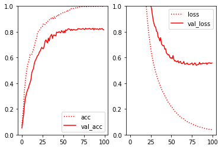
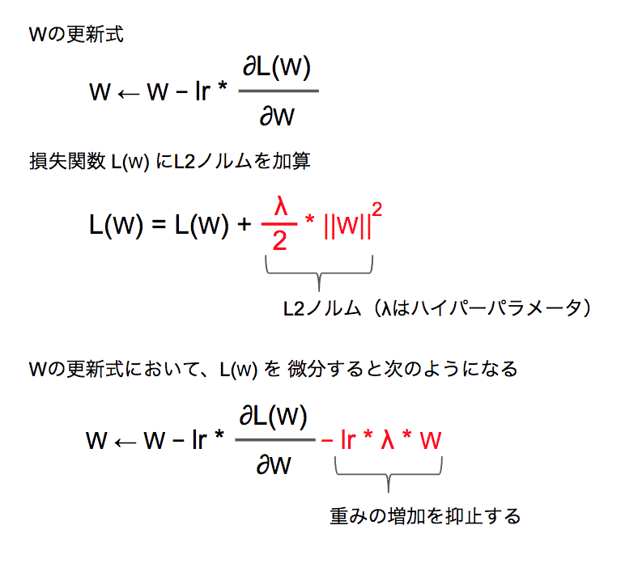
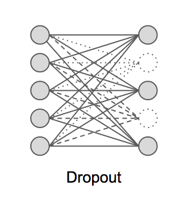
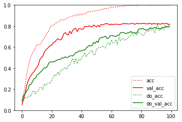

## 1.3 学習の進め方

訓練データに対して良い結果を出したとしても、実際のデータで期待する結果が得られないというケースは望ましくありません。機械学習で作成されたモデルには汎化性能が求められます。機械学習において訓練データの学習に最適化してしまうことを過学習（オーバーフィッティング）と呼びます。

ここではMNISTデータを使って過学習を再現し、次の2つの対策方法を見ていきます。

+ Weight Decay
+ Dropout

> 次節では過学習の対策だけでなく学習を効率よく進める手法であるBatch Normalizationについても取り上げます。

###  過学習の原因

過学習が発生する主な理由には以下の2つです。

+ 訓練データが不足している
+ モデルが複雑で表現力がある

ここではMNISTデータを500件に減らし、次のようなニューラルネットワークを実装してみます。

|項目|値|
|:--|:--|
|入力層|ノード数：784|
|隠れ層1|全結合層（ノード数：100）、活性化関数：relu関数|
|隠れ層2|全結合層（ノード数：100）、活性化関数：relu関数|
|隠れ層3|全結合層（ノード数：100）、活性化関数：relu関数|
|隠れ層4|全結合層（ノード数：100）、活性化関数：relu関数|
|出力層|全結合層（ノード数：10）、活性化関数：softmax関数|
|損失関数|多クラス-クロスエンロピー誤差（categorical_crossentropy）|
|オプティマイザー|確率的勾配降下法（SGD）|

また学習時のエポック数は100、バッチサイズは32と指定しています。

<div style="page-break-before:always"></div>

```python
from keras.models import Sequential
from keras.layers import Dense, Activation
from keras.utils import to_categorical
from keras.datasets import mnist

(x_train, y_train), (x_test, y_test) = mnist.load_data()

x_train = x_train.reshape(60000, 784)
x_test = x_test.reshape(10000, 784)

x_train = x_train.astype("float32")
x_test = x_test.astype("float32")
x_train /= 255
x_test /= 255

x_train = x_train[:500]
y_train = y_train[:500]
x_test = x_test[:500]
y_test = y_test[:500]

y_train = to_categorical(y_train, 10)
y_test = to_categorical(y_test, 10)

model = Sequential()
model.add(Dense(100, input_dim=784, activation='relu'))
model.add(Dense(100, activation='relu'))
model.add(Dense(100, activation='relu'))
model.add(Dense(100, activation='relu'))
model.add(Dense(10, activation='softmax'))
model.compile(optimizer='sgd', loss='categorical_crossentropy',
              metrics=['accuracy'])
history1 = model.fit(x_train, y_train, batch_size=32, epochs=100,
                                     validation_data=(x_test, y_test), verbose=1)
```

続いてグラフを表示させてみましょう。

```python
import matplotlib.pyplot as plt

plt.subplot(1,2, 1)
plt.ylim(0, 1)
plt.plot(history1.history['acc'], label="acc", color="red", linestyle='dotted')
plt.plot(history1.history['val_acc'], label="val_acc", color="red")
plt.legend()

plt.subplot(1,2, 2)
plt.ylim(0, 1)
plt.plot(history1.history['loss'], label="loss", color="red", linestyle='dotted')
plt.plot(history1.history['val_loss'], label="val_loss", color="red")
plt.legend()

plt.show()
```

プログラムを実行すると次のようなグラフが表示されるでしょう。



60エポックの辺りから、訓練データの正答率が100%近くになっています。また検証データの損失値（val_loss）についても減少が停滞しているのがわかります。このようなケースは過学習に陥っていると言えます。

<div style="page-break-before:always"></div>


## 1.4 Weight Decay

Weight Decay（重み減衰）は学習時に、大きな重みを持つことにペナルティを課すことで過学習を抑制します。

仕組みを具体的に見てみましょう。ニューラルネットワークでは学習時に、損失関数の値（loss）から勾配を算出します。その勾配に学習率を加味して重み（Weight）やバイアスを調整するのでした。Weight Decayでは損失関数の計算時に、重みの2乗ノルム（L2ノルム）を加算することで、重みの値が大きくならないように抑制します。

> 学習時の重みをW、学習率をlr、勾配を∂L(W)/∂Wとすると、次のように重みを更新します。



KerasでWeight Decayを実装するにはDenseクラスのコンストラクタでkernel_regularizerオプションを指定します。

```python
from keras import regularizers

model = Sequential()
model.add(Dense(100, kernel_regularizer=regularizers.l2(0.01)))
```

regularizers.l2クラスはL2ノルムを表現するクラスです。コンストラクタにはL2ノルムに適用するハイパーパラメータを指定します。

それでは先ほどのMNISTプログラムにWeight Decayを実装してみましょう。

```python
from keras.models import Sequential
from keras.layers import Dense, Activation
from keras.utils import to_categorical
from keras.datasets import mnist
from keras import regularizers

(x_train, y_train), (x_test, y_test) = mnist.load_data()

x_train = x_train.reshape(60000, 784)
x_test = x_test.reshape(10000, 784)

x_train = x_train.astype("float32")
x_test = x_test.astype("float32")
x_train /= 255
x_test /= 255

x_train = x_train[:500]
y_train = y_train[:500]
x_test = x_test[:500]
y_test = y_test[:500]

y_train = to_categorical(y_train, 10)
y_test = to_categorical(y_test, 10)

model = Sequential()
model.add(Dense(100, input_dim=784, activation='relu',
                                kernel_regularizer=regularizers.l2(0.03)))
model.add(Dense(100, activation='relu', kernel_regularizer=regularizers.l2(0.03)))
model.add(Dense(100, activation='relu', kernel_regularizer=regularizers.l2(0.03)))
model.add(Dense(100, activation='relu', kernel_regularizer=regularizers.l2(0.03)))
model.add(Dense(10, activation='softmax'))
model.compile(optimizer='sgd', loss='categorical_crossentropy',
              metrics=['accuracy'])
history2 = model.fit(x_train, y_train, batch_size=32, epochs=100,
                                     validation_data=(x_test, y_test), verbose=0)
```

> fitメソッドの引数にverbose=0を指定しているので訓練時の途中経過は出力しないようにしています。


続いてグラフを表示させてみましょう。ここでは一つ前の過学習した結果と合わせて表示してみます。

```python
import matplotlib.pyplot as plt

plt.ylim(0, 1)
plt.plot(history1.history['acc'], label="acc", color="red", linestyle='dotted')
plt.plot(history1.history['val_acc'], label="val_acc", color="red")
plt.plot(history2.history['acc'], label="wd_acc", color="blue", linestyle='dotted')
plt.plot(history2.history['val_acc'], label="wd_val_loss", color="blue")
plt.legend()

plt.show()
```

プログラムを実行すると次のようなグラフが表示されるでしょう。


Weight Decayによって訓練データへの過学習が抑制されているのがわかります。

<div style="page-break-before:always"></div>


## 1.5 Dropout

Dropoutはニューラルネットワーク上のノードをランダムに選別して学習する方法です。学習時はDropout層で指定した割合のノードを無効化して学習します。無効化したノードにはアクティベーションが伝搬しないようになります。たとえばDropoutする割合に0.4を指定した場合、学習の都度ランダムに40%のノードを無効化して学習していきます。



また推論時には全てのノードを使って計算を行いますが、各ノードの出力に対して、学習時に無効化した割合を乗算して出力します。たとえば学習時にDropoutで無効にした割合が0.4だった場合、推論時の出力に0.6（1.0 - 0.4）を乗算します。

KerasにはDropoutクラスが用意されています。

```python
from keras.layers import Dropout

model = Sequential()
model.add(Dropout(0.3))
```

Dropoutクラスのコンストラクタで無効化する割合を指定します。

それではKerasでDropoutを実装してみましょう。

```python
from keras.models import Sequential
from keras.layers import Dense, Activation, Dropout
from keras.utils import to_categorical
from keras.datasets import mnist

(x_train, y_train), (x_test, y_test) = mnist.load_data()

x_train = x_train.reshape(60000, 784)
x_test = x_test.reshape(10000, 784)

x_train = x_train.astype("float32")
x_test = x_test.astype("float32")
x_train /= 255
x_test /= 255

x_train = x_train[:500]
y_train = y_train[:500]
x_test = x_test[:500]
y_test = y_test[:500]

y_train = to_categorical(y_train, 10)
y_test = to_categorical(y_test, 10)

model = Sequential()
model.add(Dense(100, input_dim=784, activation='relu'))
model.add(Dropout(0.3))
model.add(Dense(100, activation='relu'))
model.add(Dropout(0.3))
model.add(Dense(100, activation='relu'))
model.add(Dropout(0.3))
model.add(Dense(100, activation='relu'))
model.add(Dropout(0.3))
model.add(Dense(10, activation='softmax'))
model.compile(optimizer='sgd', loss='categorical_crossentropy',
              metrics=['accuracy'])
history3 = model.fit(x_train, y_train, batch_size=32, epochs=100,
                    validation_data=(x_test, y_test), verbose=0)
```

> fitメソッドの引数にverbose=0を指定しているので訓練時の途中経過は出力しないようにしています。

続いてグラフを表示させてみましょう。ここでは過学習した結果と合わせて表示してみます。

```python
import matplotlib.pyplot as plt

plt.ylim(0, 1)
plt.plot(history1.history['acc'], label="acc", color="red", linestyle='dotted')
plt.plot(history1.history['val_acc'], label="val_acc", color="red")
plt.plot(history3.history['acc'], label="do_acc", color="green", linestyle='dotted')
plt.plot(history3.history['val_acc'], label="do_val_acc", color="green")
plt.legend()

plt.show()
```

プログラムを実行すると次のようなグラフが表示されるでしょう。



Dropoutによって訓練データへの過学習が抑制されているのがわかります。
