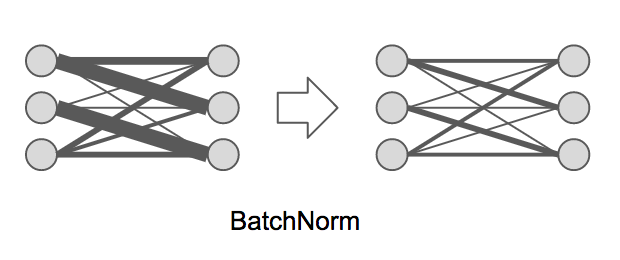

## 1.6 Batch Normalization

これまでにニュラールネットワーク上の重みの更新を抑制するWeight Decayやノード自体を無効化してしまうDropoutという方法について学習しました。これらの方法を上手く使えば過学習を抑制しながら開発を進めることができそうです。次に学ぶBatch Normalizationは、ノードや重みを調整するのではなく、ニューラルネットワークを流れるデータそのものを調整する技術です。



Batch Normalizationは、ノード間を流れるデータについて適度なバラつきを持つように調整します。具体的にはバッチ単位でノード間を流れるデータを平均0、分散1の標準正規分布に従うように調整します。Batch Normalizationによって次のような成果を期待できます。

+ 学習速度の向上
+ 過学習の抑制
+ 重みの初期値への依存の排除

KerasにはBatchNormalizationレイヤーが用意されています。

```python
from keras.layers import BatchNormalization

model = Sequential()
model.add(BatchNormalization())
```

それではKerasでBatchNormalizationを実装してみましょう。ここではMNISTデータを処理するプログラムにBatchNormalizationを適用してみましょう。

```python
from keras.models import Sequential
from keras.layers import Dense, Activation, BatchNormalization
from keras.utils import to_categorical
from keras.datasets import mnist

(x_train, y_train), (x_test, y_test) = mnist.load_data()

x_train = x_train.reshape(60000, 784)
x_test = x_test.reshape(10000, 784)

x_train = x_train.astype('float32')
x_test = x_test.astype('float32')
x_train /= 255
x_test /= 255

y_train = to_categorical(y_train, 10)
y_test = to_categorical(y_test, 10)

model = Sequential()
model.add(Dense(50, input_dim=784))
model.add(BatchNormalization())
model.add(Activation('relu'))
model.add(Dense(20))
model.add(BatchNormalization())
model.add(Activation('relu'))
model.add(Dense(10))
model.add(Activation('softmax'))
model.compile(optimizer='sgd', loss='categorical_crossentropy',
              metrics=['accuracy'])

history = model.fit(x_train, y_train, batch_size=32, epochs=10,
                    validation_data=(x_test, y_test))
```

プログラムの実行結果は次のようになるでしょう。

```
Train on 60000 samples, validate on 10000 samples
Epoch 1/10
60000/60000 10s - loss: 0.6851 - acc: 0.8290 - val_loss: 0.2708 - val_acc: 0.9309
Epoch 2/10
60000/60000 10s - loss: 0.2891 - acc: 0.9202 - val_loss: 0.1935 - val_acc: 0.9457
Epoch 3/10
60000/60000 10s - loss: 0.2224 - acc: 0.9364 - val_loss: 0.1591 - val_acc: 0.9567
Epoch 4/10
60000/60000 10s - loss: 0.1906 - acc: 0.9450 - val_loss: 0.1400 - val_acc: 0.9596
Epoch 5/10
60000/60000 12s - loss: 0.1670 - acc: 0.9517 - val_loss: 0.1317 - val_acc: 0.9628
Epoch 6/10
60000/60000 10s - loss: 0.1517 - acc: 0.9560 - val_loss: 0.1260 - val_acc: 0.9636
Epoch 7/10
60000/60000 10s - loss: 0.1396 - acc: 0.9583 - val_loss: 0.1173 - val_acc: 0.9671
Epoch 8/10
60000/60000 10s - loss: 0.1305 - acc: 0.9614 - val_loss: 0.1087 - val_acc: 0.9703
Epoch 9/10
60000/60000 10s - loss: 0.1216 - acc: 0.9636 - val_loss: 0.1094 - val_acc: 0.9688
Epoch 10/10
60000/60000 10s - loss: 0.1135 - acc: 0.9656 - val_loss: 0.1028 - val_acc: 0.9691
```

検証データの正答率（val_acc）も97%近くまで上昇しています。上記のプログラムにおいてBatchNormalizationを消去してみる95%程度になるので効率よく学習できているのがわかります。
