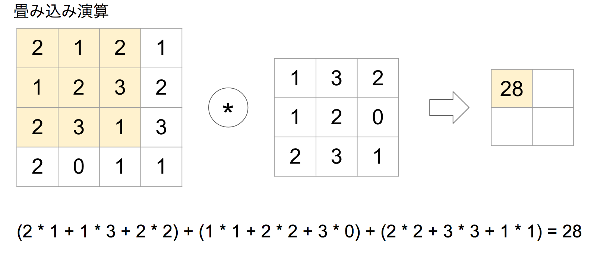
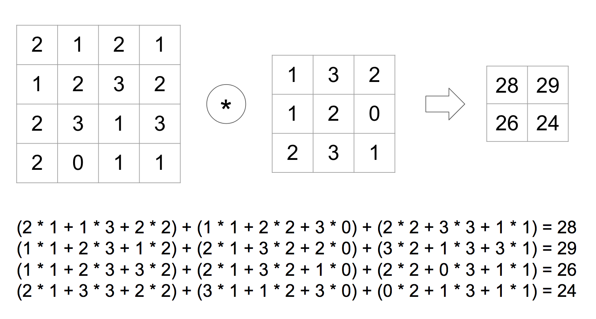
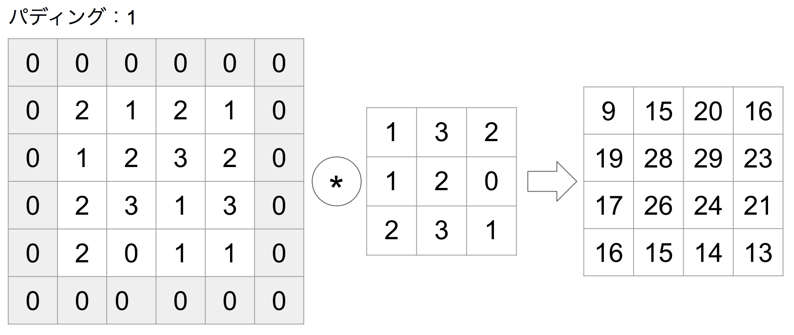
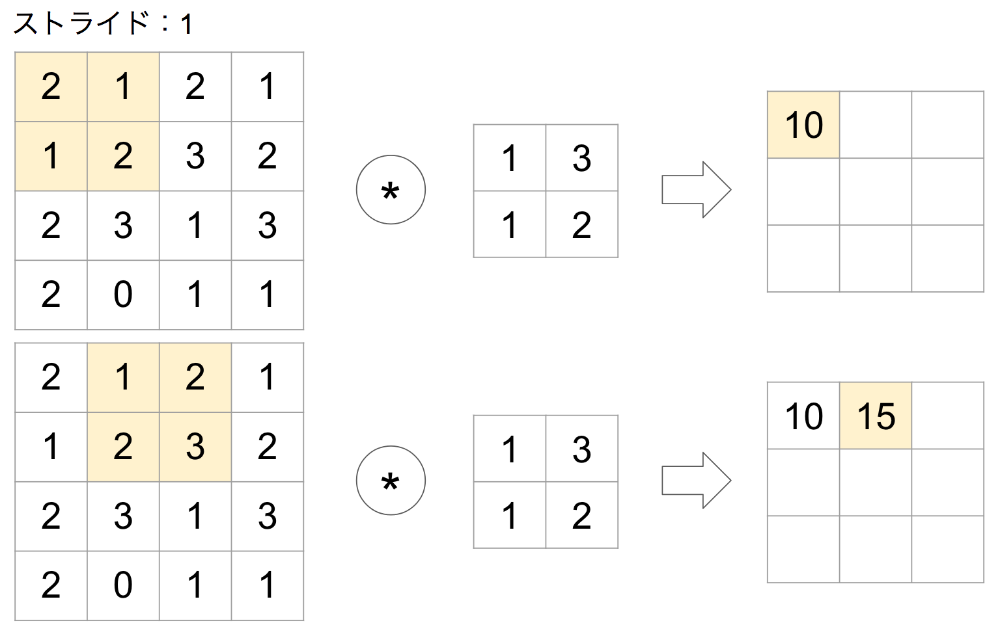
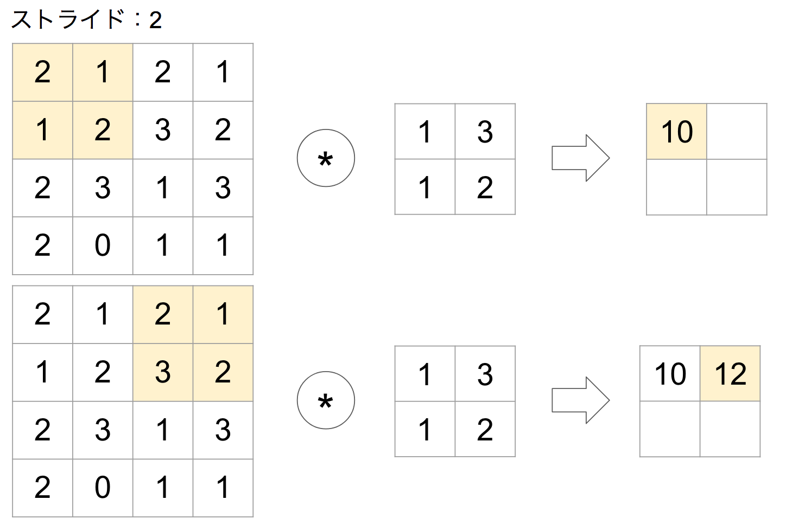
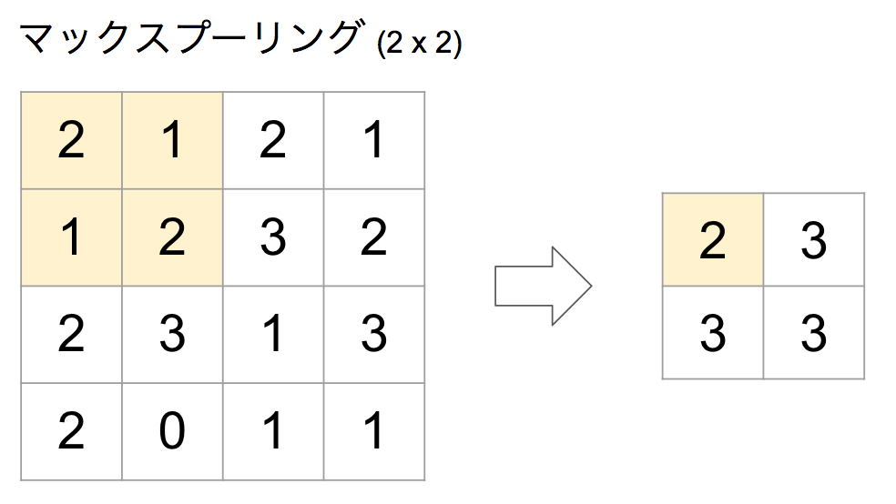

# 2 畳み込みニューラルネットワーク

続いて畳み込みニューラルネットワーク（CNN : Convolutional Neural Network）を構築して、画像認識にチャレンジしてみましょう。

畳み込みニューラルネットワークとは、全結合型ニューラルネットワークに、畳み込み層（Convolutional Layer）やプーリング層（Pooling Layer）を追加したものです。CNNは音声認識や画像認識といった様々な目的に利用されています。特に画像認識の分野で高い精度を上げています。

CNNは次のようなネットワークになります。


本章では畳み込みニューラルネットワークの実装例を解説し、畳み込みニューラルネットワークを構成する次の3つの層の仕組みについて学習します。

+ 畳み込み層（Conv2D）
+ プーリング層（MaxPooling2D）
+ 平滑化層（Flatten）

<div style="page-break-before:always"></div>

## 2.1 畳み込みニューラルネットワークの実装

Kerasを使って畳み込みニューラルネットワークを実装してみましょう。以下の構成に従ってニューラルネットワークを構築します。

|項目|値|
|:--|:--|
|入力層|ノード数：28 x 28 x 1|
|隠れ層1|畳み込み層（ノード数：50、カーネルサイズ：3 x 3）、活性化関数：relu関数|
|隠れ層2|プーリング層（プールサイズ：2 x 2）|
|隠れ層3|平滑化層 |
|出力層|全結合層（ノード数：10）、活性化関数：softmax関数|
|損失関数|多クラス-クロスエンロピー誤差（categorical_crossentropy）|
|オプティマイザー| AdaGrad |

<div style="page-break-before:always"></div>

```python
from keras.datasets import mnist
from keras.models import Sequential
from keras.layers import Dense, Activation, Conv2D, MaxPooling2D, Flatten
from keras.utils import to_categorical

(x_train, y_train), (x_test, y_test) = mnist.load_data()

x_train = x_train.reshape(60000, 28, 28, 1)
x_test = x_test.reshape(10000, 28, 28, 1)

x_train = x_train.astype("float32")
x_test = x_test.astype("float32")
x_train /= 255
x_test /= 255

y_train = to_categorical(y_train, 10)
y_test = to_categorical(y_test, 10)

model = Sequential()
model.add(Conv2D(32, kernel_size=(3, 3), input_shape=(28, 28, 1)))
model.add(Activation("relu"))
model.add(MaxPooling2D(pool_size=(2, 2)))
model.add(Flatten())
model.add(Dense(10))
model.add(Activation("softmax"))

model.compile(loss="categorical_crossentropy",
              optimizer="adagrad",
              metrics=["accuracy"])

model.fit(x_train, y_train, batch_size=64, epochs=5)

score = model.evaluate(x_test, y_test, verbose=0)
print("test acc : ", score[1])
```

プログラムを実行すると次のような結果が表示されるでしょう。

```
Epoch 1/5
60000/60000 7s 110us/step - loss: 0.2325 - acc: 0.9348
Epoch 2/5
60000/60000 6s 93us/step - loss: 0.1228 - acc: 0.9658
Epoch 3/5
60000/60000 6s 93us/step - loss: 0.0992 - acc: 0.9731
Epoch 4/5
60000/60000 6s 93us/step - loss: 0.0868 - acc: 0.9767
Epoch 5/5
60000/60000 6s 93us/step - loss: 0.0785 - acc: 0.9792
test acc :  0.9772
```

<div style="page-break-before:always"></div>

## 2.2 畳み込みレイヤー

まずは全結合型ニューラルネットワークについて復習しておきましょう。

```python
model = Sequential()
model.add(Dense(50, input_dim=784))
```

全結合型ニューラルネットワークでは、画像データを784個の要素の配列（ベクトル）に変換しているのがわかります。これはつまり、画像データの形状（縦28px、横28px）が無視されているのがわかります。

画像のようなデータには空間情報が含まれています。ここで言う空間情報とは縦、横（あるいは奥行き）のようなデータの関係性のことで、例えば、空や海といった風景写真であれば隣接するピクセルは類似した色が並んでいるでしょう。畳み込み層はこのような空間情報をうまく取り扱うことのできる仕組みです。

### 畳み込み演算

畳み込み層では入力データにフィルターを適用します。たとえば4x4の入力データに対して、3x3のフィルターを適用すると次のような演算が行われます。

> フィルターはカーネルと呼ばれることもあります。





このような演算は積和演算と呼ばれることもあります。Pythonプログラムで実装すると次のようになります。

```python
import numpy as np

img = np.array([[2,1,2,1],
                [1,2,3,2],
                [2,3,1,3],
                [2,0,1,1]])

filter = np.array([[1,3,2], [1,2,0], [2,3,1]])

img_width = img.shape[0]
img_height = img.shape[1]

filter_width = filter.shape[0]
filter_height = filter.shape[1]

for i in range(img_height - filter_height + 1):
    for j in range(img_width - filter_width + 1):
        z = 0
        z += img[i][j + 0] * filter[0][0]
        z += img[i][j + 1] * filter[0][1]
        z += img[i][j + 2] * filter[0][2]

        z += img[i + 1][j + 0] * filter[1][0]
        z += img[i + 1][j + 1] * filter[1][1]
        z += img[i + 1][j + 2] * filter[1][2]

        z += img[i + 2][j + 0] * filter[2][0]
        z += img[i + 2][j + 1] * filter[2][1]
        z += img[i + 2][j + 2] * filter[2][2]

        print(z, end=' ')
    print("")
```

実行結果は次のようになります。

```
28 29
26 24
```

<div style="page-break-before:always"></div>

### 畳み込み層（Conv2D）

Kerasにおいて畳み込み層を実装するにはConv2Dクラスを使います。

```python
from keras.layers import Conv2D

model = Sequential()
model.add(Conv2D(32, kernel_size=(3, 3), input_shape=(28, 28, 1)))
```

ここでは入力データ（input_shape）で28x28の1チャネル画像を受け取り、3x3のフィルターを適用して畳み込み演算を行っています。もしRGBカラーのような3チャネルの画像を処理する場合はinput_shape=(28, 28, 3)のように指定します。

> ニューラルネットワークの学習時にフィルターの持つ重みが更新されていきます。

畳み込み層にはパディングやストライドといったオプションも指定できます。

#### パディング

パディングとは入力データの周囲に余白をとる仕組みです。



パディングを指定することで出力データのサイズが変わります。上記のようにパディングサイズを1に指定すれば入力データと同じサイズの出力を得ることができます。

パディングを指定しないと出力データサイズが小さくなる点を理解しておきましょう。複数の畳み込み層を使う場合、畳み込み演算の度に出力データサイズが小さくなると、出力サイズが1になってしまい、以降の畳み込み演算を行えなくなる可能性があります。そのような場合はパディングによって出力サイズを保つことが大事になります。

KerasではConv2Dクラスのコンストラクタの引数paddingオプションでパディングの有無を指定します。

```python
model.add(Conv2D(64, (3, 3), padding='same'))
```

paddingオプションには'valid'と'same'のいずれかを指定します。'same'を指定すると入力データと出力データサイズが同じになります。フィルターサイズが3x3の場合は、パディングに1を指定するのと同じになります。'valid'を指定するとパディングは適用しないのでデータサイズは小さくなります。paddingオプションのデフォルトは'valid'です。

<div style="page-break-before:always"></div>

#### ストライド

ストライドはフィルターを適用する間隔を意味します。ストライドが1の場合の畳み込み演算はこれまでに見てきたとおりです。



ストライドが2の場合の畳み込み演算は次のようになります。



ストライドを大きくすると出力データサイズが小さくなります。

KerasではConv2Dクラスのコンストラクタの引数stridesオプションでストライドを指定します。

```python
model.add(Conv2D(64, (3, 3), strides=2))
```

次のように縦横のストライドをタプルで指定することもできます。

```python
model.add(Conv2D(64, (3, 3), strides=(2,2)))
```

<div style="page-break-before:always"></div>

## 2.3 プーリングレイヤー

プーリングは画像データのような空間データを小さくする仕組みです。ニューラルネットワーク上を流れるデータを圧縮する用途に使います。プーリングを導入することによって入力データの微小な変化に対してロバスト（頑健）になります。

#### プーリング演算

プーリングにはMAXプーリング/AVERAGEプーリングといった手法があります。次の例はMAXプーリングの演算です。



上記の例では4x4の入力データに対して、プーリングサイズ2x2を指定しています。プーリングサイズが2x2の場合、元のデータを半分のサイズにして出力します。

> プーリング時のストライドはプーリングサイズと同じにするのが一般的です。この場合、ストライドは2となります。

プーリング演算をPythonプログラムで実装すると次のようになります。

```python
import numpy as np

img = np.array([[2,1,2,1],
                [1,2,3,2],
                [2,3,1,3],
                [2,0,1,1]])

img_width = img.shape[0]
img_height = img.shape[1]

pool_width = 2
pool_height = 2

for i in range(0, img_width, pool_width):
    for j in range(0, img_height, pool_height):
        pool = [img[i][j + 0], img[i][j+ 1], img[i + 1][j + 0], img[i + 1][j + 1]]
        print(np.max(pool), end=' ')
    print("")
```

実行結果は次のようになります。

```
2 3
3 3
```


### プーリング層（MaxPooling2D）

Kerasにおいてプーリング層を実装するにはMaxPooling2Dクラスを使います。

```python
from keras.layers import MaxPooling2D

model = Sequential()
model.add(MaxPooling2D(pool_size=(2, 2)))
```

ここではプーリングサイズを2x2に指定しています。

> pool_sizeオプションを省略した場合のデフォルトも(2, 2)となっています。

プーリングには重みのようなパラメータは使用しません。言い方を変えればプーリング層には学習するパラメータが存在しないということです。

<div style="page-break-before:always"></div>

## 2.4 平滑化レイヤー

平滑化は入力データをフラットにすることです。具体的には畳み込み層やプーリング層の出力を全結合層に変換するときなどに使います。


### 平滑化層（Flatten）

Kerasにおいて平滑化層を表現するにはFlattenクラスを使います。

```python
from keras.layers import Flatten

model = Sequential()
model.add(Flatten())
```

次のプログラムは畳み込み層の出力を平滑化するものです。

```python
from keras.models import Sequential
from keras.layers import Conv2D, Flatten

model = Sequential()
model.add(Conv2D(64, kernel_size=(5, 5), input_shape=(32, 32, 3), padding='same'))
print(model.output_shape)

model.add(Flatten())
print(model.output_shape)
```

上記のプログラムを実行すると次のような出力が表示されるでしょう。

```
(None, 32, 32, 64)
(None, 65536)
```

> タプルの先頭のNoneは訓練時のサンプル件数を表すものです。

この場合Conv2Dレイヤーの出力は（32, 32, 64）となっていますが、Flattenレイヤーによって平滑化された出力は65536（=32x32x64）となっているのがわかります。
