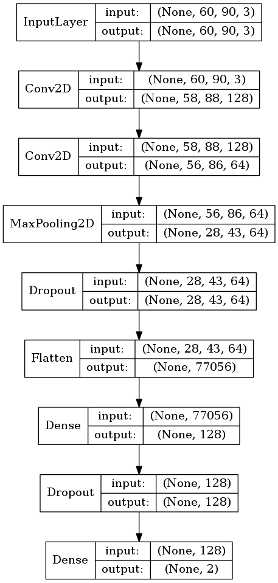

## 2.5 サンプルデータ

以降はMNISTデータから離れて、独自データセットで検証してみましょう。ここではリンゴの画像データセットとそれ以外（バナナ）の画像データセットを使って2値分類に取り組みます。

+ dirA
  + リンゴの画像データ
+ dirB
  + リンゴ以外（バナナ）の画像データ

> 本講座で扱うデータセットはImageNetから取得してきたものです。ImageNetは画像認識コンテストILSVRC（ImageNet Large Scale Visual Recognition Challenge）を運営しています。

### （参考）画像ダウンロードのサンプルコード

ここではインターネット上の共有画像データセットを活用して、機械学習に取り組む方法を取り上げます。次のプログラムは大規模画像データベースImage Netから画像をダウンロードするサンプルプログラムです。

<div style="page-break-before:always"></div>

```python
import sys
import os
from urllib import request
from PIL import Image

def download(url, decode=False):
    response = request.urlopen(url)
    no_image = "https://s.yimg.com/pw/images/en-us/photo_unavailable.png"
    if response.geturl() == no_image:
        # Flickr :This photo is no longer available iamge.
        raise Exception("This photo is no longer available iamge.")

    body = response.read()
    if decode == True:
        body = body.decode()
    return body

def write(path, img):
    file = open(path, 'wb')
    file.write(img)
    file.close()

classes = {"apple":"n07739125", "banana":"n07753592"}
# classes = {"cherry":"n07757132"}

offset = 0
max = 10 # 2000
for dir, id in classes.items():
    print(id)
    os.makedirs(dir, exist_ok=True)
    urls = download(
        "http://www.image-net.org/api/text/imagenet.synset.geturls?wnid="+id,
        decode=True).split()
    print(len(urls))
    i = 0
    for url in urls:
        if i < offset:
            continue
        if i > max:
            break

        try:
            file = os.path.split(url)[1]
            path = dir + "/" + file
            write(path, download(url))
            print("done:" + str(i) + ":" + file)
        except:
            print("Unexpected error:", sys.exc_info()[0])
            print("error:" + str(i) + ":" + file)
        i = i + 1

print("end")
```

上記のプログラムを実行すると apple と banana の画像をダウンロードできます。その他の画像をダウンロードしたい場合はプログラムの以下の部分を変更すると良いでしょう。

```python
classes = {"apple":"n07739125", "banana":"n07753592"}
```

> 指定可能な値は以下のページで確認できます。 http://image-net.org/archive/words.txt

またダウンロードする画像数を変更するには以下のプログラムを修正します。

```python
max = 10 # 2000
```

#### 画像データの取り扱いについて

ImageNetは画像の著作権を所有していないため取り扱いには注意が必要です。ここでは機械学習の手法を学ぶ目的に限定して利用するものとします。

<div style="page-break-before:always"></div>

### channels_last / channels_first

画像データをベクトル化する際、チャネル数を最後に表現するか、先頭に表現するか2つの考え方があります。たとえば先のケースはチャネル数を最後に表現しています（channels_last）。

```
(60, 90, 3)
```

一方、チャネル数を先頭で表現する（channels_first）場合は次のようになります。

```
(3, 60, 90)
```

KerasのAPIには data_format として channels_last / channels_firstを指定する箇所が多くあります。指定しない場合のデフォルトはchannels_lastとなっています。

<div style="page-break-before:always"></div>


#### 画像処理ユーティリティ

本講座で扱う画像ファイルをベクトルに変換するユーティリティ（image_utils.py）です。

> KerasのAPIを活用すれば不要となります。

```python
from PIL import Image
import os
import numpy as np
from keras.preprocessing.image import load_img, img_to_array
from sklearn.model_selection import train_test_split

def load_images(dirA, dirB):
    rowsA, labelsA = to_array(dirA, [1])
    rowsB, labelsB = to_array(dirB, [0])
    data = np.r_[rowsA, rowsB]
    label = np.r_[labelsA, labelsB]
    return train_test_split(data, label)

def to_array(dir, label):
    rows = []
    labels = []
    for f in os.listdir(dir):
        if f.startswith(".") == False :
            row = img_to_array(load_img(dir + "/" + f))
            rows.append(row)
            labels.append(label)
    return (np.array(rows), np.array(labels))

```

整形済みの画像をベクトルとしてロードするには次のように利用できます。

```python
from image_utils import load_images

x_train, x_test, y_train, y_test = load_images("dirA", "dirB")

print(x_train.shape)
print(x_test.shape)
print(y_train.shape)
print(y_test.shape)
```

<div style="page-break-before:always"></div>

## サンプルプログラム

最後にload_images関数を利用したKerasのCNNプログラムを作成してみましょう。

> ここではImageNetからダウンロードした画像を想定してサンプルプログラムを実装しています。




```python
import keras
from keras.models import Sequential
from keras.layers import Dense, Dropout, Flatten
from keras.layers import Conv2D, MaxPooling2D
from image_utils import load_images

x_train, x_test, y_train, y_test = load_images("dirA", "dirB")

x_train = x_train.astype('float32')
x_test = x_test.astype('float32')
x_train /= 255
x_test /= 255

model = Sequential()
model.add(Conv2D(128, kernel_size=(3, 3),
                    input_shape=(60, 90, 3), activation='relu'))
model.add(Conv2D(64, kernel_size=(3, 3), activation='relu'))
model.add(MaxPooling2D(pool_size=(2, 2)))
model.add(Dropout(0.25))
model.add(Flatten())
model.add(Dense(128, activation='relu'))
model.add(Dropout(0.5))
model.add(Dense(1, activation='sigmoid'))

model.compile(loss=keras.losses.binary_crossentropy,
           optimizer=keras.optimizers.Adadelta(),
           metrics=['accuracy'])

history = model.fit(x_train, y_train,
          batch_size=32,
          epochs=20,
          validation_data=(x_test, y_test),
          verbose=1)


import matplotlib.pyplot as plt

plt.ylim(0.0, 1)
plt.plot(history.history['acc'], label="acc")
plt.plot(history.history['val_acc'], label="val_acc")
plt.legend()

plt.show()
```

実行結果は次のようになるでしょう。

```
...省略
Epoch 17/20
1173/1173 3s - loss: 0.0572 - acc: 0.9804 - val_loss: 0.8526 - val_acc: 0.7570
Epoch 18/20
1173/1173 3s - loss: 0.0524 - acc: 0.9804 - val_loss: 1.0598 - val_acc: 0.7724
Epoch 19/20
1173/1173 3s - loss: 0.0674 - acc: 0.9795 - val_loss: 0.8944 - val_acc: 0.7570
Epoch 20/20
1173/1173 3s - loss: 0.0420 - acc: 0.9864 - val_loss: 0.8620 - val_acc: 0.7545
```

訓練データの正答率（acc）は高いですが、テストデータの正答率（val_acc）は80%を下回ります。結果から過学習の傾向が見られます。

正答率をグラフ化してみましょう。

```python
import matplotlib.pyplot as pltm

plt.ylim(0.5, 1)
plt.plot(history.history['acc'], label="acc")
plt.plot(history.history['val_acc'], label="val_acc")
plt.legend()

plt.show()
```


原因についてはいくつか考えられますが、訓練データが不足している可能性があります。
