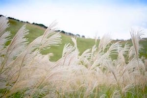
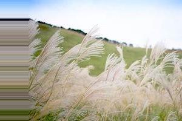
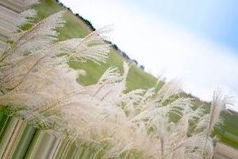

# 3 データ拡張

機械学習には既存のデータにノイズを加えることで、学習データを拡張（増加）するという手法があります。このような手法はData Augmentationと呼ばれます。Data Augmentationは十分な学習データを用意できないときに活用することができます。

たとえば画像認識においては次のようにして学習データを増やす方法があります。

+ 画像の水平（垂直）移動
+ 画像の回転（反転）
+ 画像の拡大・縮小
+ カラーの変更

ここではKerasのImageDataGeneratorクラスを活用してData Augmentationに取り組みます。

<div style="page-break-before:always"></div>

## 3.1 画像データの生成

### 画像の水平（垂直）移動

それではImageDataGeneratorクラスを使って、画像の水平移動を確認してみましょう。ここでは以下の画像（sample.jpg）をサンプルにImageDataGeneratorクラスの使い方を解説します。



```python
import numpy as np
from keras.preprocessing.image import ImageDataGenerator
from keras.preprocessing.image import load_img, img_to_array, array_to_img

src_file = "sample.jpg"
dest_file = "shifted_sample.jpg"

sample = img_to_array(load_img(src_file))
samples = np.array([sample])

datagen = ImageDataGenerator(width_shift_range=0.3)
it = datagen.flow(samples)
array_to_img(it.next()[0]).save(dest_file)
```

上記のプログラムを実行すると次のような画像ファイルが生成されるでしょう。



<div style="page-break-before:always"></div>

ImageDataGeneratorクラスはコンストラクタの引数に加工方法を指定します。ここではwidth_shift_rangeによって画像の水平移動を指定しています。width_shift_rangeにはランダムに水平シフトする範囲（横幅に対する割合）を指定します。

```python
datagen = ImageDataGenerator(width_shift_range=0.3)
```

> 垂直移動はheight_shift_rangeを使います。


ImageDataGeneratorインスタンスのflowメソッドを呼び出すとイテレータが返ります。

```python
it = datagen.flow(samples)
```


イテレータに対してnext()メソッドを呼び出すと、指定したバッチサイズ（デフォルトは32）で画像を生成できます。


> it = datagen.flow(samples, batch_size=16) のようにバッチサイズを指定することもできます。


```python
array_to_img(it.next()[0]).save(dest_file)
```

ここでは1件のサンプルデータしか使っていないためit.next()の戻り値は1件の画像データになります。

<div style="page-break-before:always"></div>

### 画像の回転（反転）

ImageDataGeneratorクラスを使って画像の回転を確認してみましょう。

```python
import numpy as np
from keras.preprocessing.image import ImageDataGenerator
from keras.preprocessing.image import load_img, img_to_array, array_to_img

src_file = "sample.jpg"
dest_file = "rotated_sample.jpg"

sample = img_to_array(load_img(src_file))
samples = np.array([sample])

datagen = ImageDataGenerator(rotation_range=30)
it = datagen.flow(samples)

array_to_img(it.next()[0]).save(dest_file)
```

上記のプログラムを実行すると次のような画像ファイルが生成されるでしょう。



ImageDataGeneratorクラスのコンストラクタにrotation_rangeを指定することで画像の回転を指定しています。rotation_rangeにはランダムに回転する回転範囲（0-180）を指定します。

```python
datagen = ImageDataGenerator(rotation_range=30)
```

> 画像を縦横に反転する場合はvertical_flip=Trueやhorizontal_flip=Trueを指定します。

<div style="page-break-before:always"></div>

### 画像の拡大・縮小

ImageDataGeneratorクラスを使って画像の拡大を確認してみましょう。

```python
import numpy as np
from keras.preprocessing.image import ImageDataGenerator
from keras.preprocessing.image import load_img, img_to_array, array_to_img

src_file = "sample.jpg"
dest_file = "zoomed_sample.jpg"

sample = img_to_array(load_img(src_file))
samples = np.array([sample])

datagen = ImageDataGenerator(zoom_range=0.3)
it = datagen.flow(samples)

array_to_img(it.next()[0]).save(dest_file)
```

上記のプログラムを実行すると次のような画像ファイルが生成されるでしょう。


ImageDataGeneratorクラスのコンストラクタにzoom_rangeを指定することで画像の拡大を指定しています。zoom_rangeにはランダムにズームする範囲を指定します。

```python
datagen = ImageDataGenerator(rotation_range=30)
```

<div style="page-break-before:always"></div>

### カラーの変更

ImageDataGeneratorクラスを使ってカラーの変更を確認してみましょう。

```python
import numpy as np
from keras.preprocessing.image import ImageDataGenerator
from keras.preprocessing.image import load_img, img_to_array, array_to_img

src_file = "sample.jpg"
dest_file = "channel_shifted_sample.jpg"

sample = img_to_array(load_img(src_file))
samples = np.array([sample])

datagen = ImageDataGenerator(channel_shift_range=30)
it = datagen.flow(samples)

array_to_img(it.next()[0]).save(dest_file)
```

上記のプログラムを実行すると次のような画像ファイルが生成されるでしょう。


ImageDataGeneratorクラスのコンストラクタにchannel_shift_rangeを指定することでカラーチャネルの変更を指定しています。channel_shift_rangeにはランダムにチャンネルをシフトする範囲を指定します。

```python
datagen = ImageDataGenerator(channel_shift_range=30)
```

<div style="page-break-before:always"></div>

### 画像ファイルの一括生成

ImageDataGeneratorクラスを使って複数の画像をオプションを指定して、画像ファイルを一括生成してみましょう。

```python
import os
import numpy as np
from keras.preprocessing.image import ImageDataGenerator
from keras.preprocessing.image import load_img, img_to_array, array_to_img

src_file = "sample.jpg"

dest_dir = "dest"
os.makedirs(dest_dir, exist_ok=True)
dest_file = "dest/pic_{0:02d}.jpg"

samples = np.array([img_to_array(load_img(src_file))])

datagen = ImageDataGenerator(width_shift_range=0.3,
                             rotation_range=30,
                             zoom_range=0.3,
                             channel_shift_range=50,
                             horizontal_flip=True,
                             vertical_flip=True,
                             fill_mode="reflect")

for i in range(1, 100):
    it = datagen.flow(samples)
    array_to_img(it.next()[0]).save(dest_file.format(i))
```

上記のプログラムを実行するとdestフォルダ下にpic01.jpg〜pic99.jpgファイルが生成されます。
