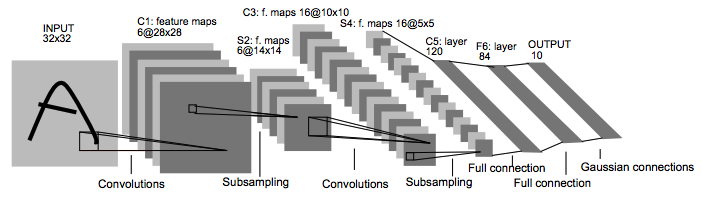
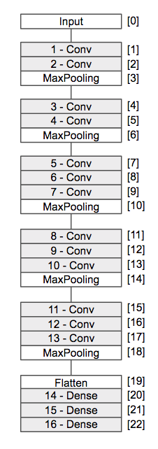
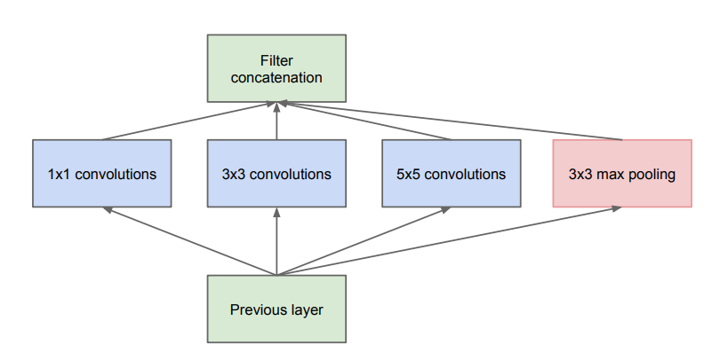
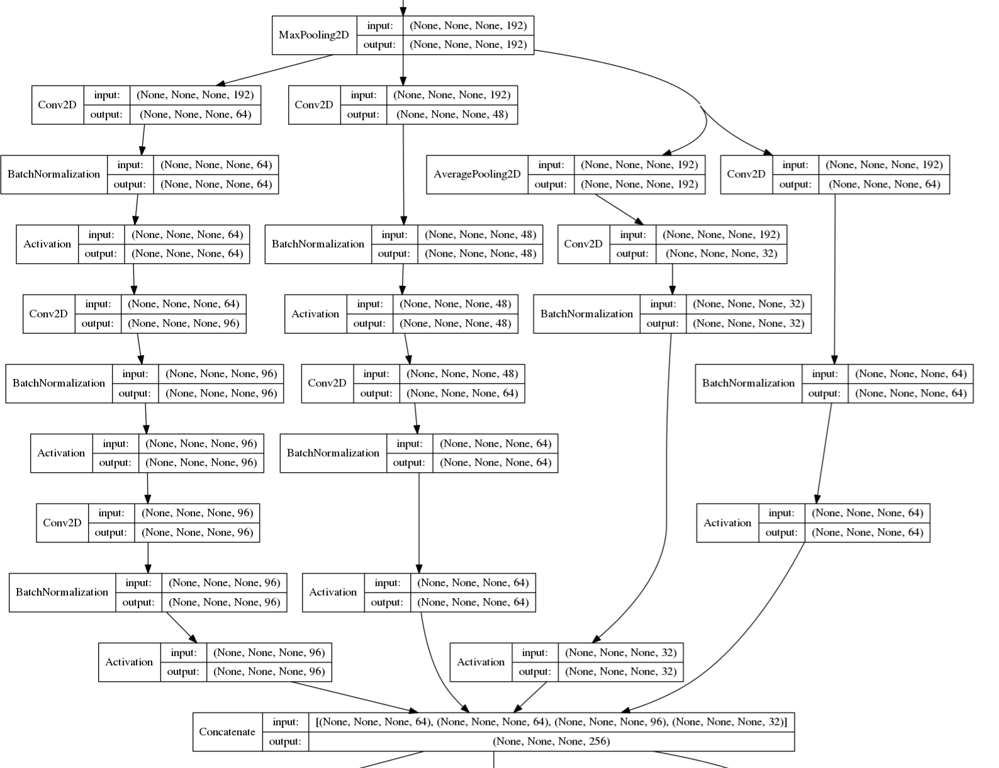
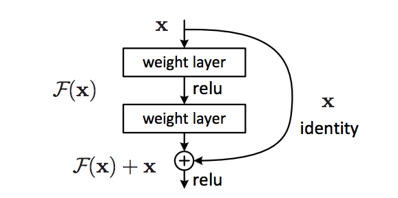

# 4 学習済みモデルの再利用

KerasにはVGG16やInceptionV3といった画像認識に利用可能なモデルが用意されています。これらのモデルはImageNetを活用した画像認識コンテストであるILSVRCで優秀な成績を収めたものがベースとなっています。

## 4.1 画像認識モデルの発展

ここではCNNをベースにした画像認識モデルの発展の歴史を振り返ってみましょう。

### LeNet

CNNの考え方のルーツは1998年頃にYann LeCun氏によって発表されたLeNetと言われています。



> 画像引用：http://yann.lecun.com/exdb/publis/pdf/lecun-98.pdf より

LeNetは畳み込みレイヤーとサブサンプリングレイヤー、全結合レイヤーで構成されています。当時はプーリングレイヤーではなく、サブサンプリングレイヤーと呼ばれていましたが、CNNの原型はこの頃から提案されていたのがわかります。1998年当時はマシンスペックやデータの準備に課題があり、LeNetは実用に至りませんでした。

### AlexNet

CNNが注目されるきっかけになったのが2012年に登場したAlexNetです。AlexNetは2012年のImageNet上のデータを活用した画像認識コンテスト（ILSVRC）で前年度の結果（画像の認識率）を10%近く改善したことで大きな注目を集めるようになります。


AlexNetでは畳み込みレイヤー、プーリングレイヤー、全結合レイヤーで構成されています。LeNetと比較すると活性化関数にReLU関数に使用したり、Dropoutレイヤーを導入したりといった改善が提案されています。

AlexNet以降も様々な画像認識モデルが提案されています。

+ VGG16
  + 畳み込み層、プーリング層、全結合層で構成されるシンプルなCNN。学習用のパラメータを持つ層が16層で構成されている。
+ Inception
  + Googleの研究チームの発表したCNN。インセプション構造と呼ばれる仕組みにより、並列で学習を行うことができる。
+ ResNet
  + Microsoftの研究チームの発表したCNN。ショートカット接続と呼ばれる仕組みにより、より深い層でも学習が行える。

<div style="page-break-before:always"></div>

## 4.2 学習済みモデルの再利用

KerasはImageNetで学習した重みパラメータをもつ学習済みモデルを提供しています。

+ VGG16
+ VGG19
+ InceptionV3
+ Xception
+ ResNet50

VGG19はVGG16のレイヤー数を19層と深くしたものです。またXceptionはInceptionV3をベースに考案されたものです。本書ではシンプルなCNNとして実装されているVGG16の利用例を中心に取り上げます。

<div style="page-break-before:always"></div>

#### VGG16

VGG16は畳み込み層、プーリング層、全結合層で構成されているシンプルなCNNです。学習用のパラメータを持つ層が16層で構成されているためVGG16という名前になっています。



VGG16の論文はarxiv.orgの以下のページで確認できます。

[Very Deep Convolutional Networks for Large-Scale Image Recognition]
https://arxiv.org/abs/1409.1556

> arxiv.orgは数学、物理学、統計学など様々な分野の論文が保存・公開されているウェブサイトです。ディープラーニングに関連する多くの論文もarxiv.orgにて公開されています。

<div style="page-break-before:always"></div>

それでは実際にVGG16を使って画像認識に取り組んでみましょう。まずは次のようにVGG16の詳細を確認してみましょう。

```python
from keras.applications.vgg16 import VGG16

model = VGG16(weights='imagenet')
print(model.summary())
```

> 初回実行時はインターネット上からVGG16のモデル（パラメータ）がダウンロードされます。ダウンロードしたモデルはホームフォルダ上の.keras/modelsフォルダに格納されます。

プログラムを実行すると次のようなモデルのサマリーが表示されるでしょう。

```
_________________________________________________________________
Layer (type)                 Output Shape              Param #   
=================================================================
input_1 (InputLayer)         (None, 224, 224, 3)       0         
_________________________________________________________________
block1_conv1 (Conv2D)        (None, 224, 224, 64)      1792      
_________________________________________________________________
block1_conv2 (Conv2D)        (None, 224, 224, 64)      36928     
_________________________________________________________________
block1_pool (MaxPooling2D)   (None, 112, 112, 64)      0         
_________________________________________________________________
block2_conv1 (Conv2D)        (None, 112, 112, 128)     73856     
_________________________________________________________________
block2_conv2 (Conv2D)        (None, 112, 112, 128)     147584    
_________________________________________________________________
block2_pool (MaxPooling2D)   (None, 56, 56, 128)       0         
_________________________________________________________________
block3_conv1 (Conv2D)        (None, 56, 56, 256)       295168    
_________________________________________________________________
block3_conv2 (Conv2D)        (None, 56, 56, 256)       590080    
_________________________________________________________________
block3_conv3 (Conv2D)        (None, 56, 56, 256)       590080    
_________________________________________________________________
block3_pool (MaxPooling2D)   (None, 28, 28, 256)       0         
_________________________________________________________________
block4_conv1 (Conv2D)        (None, 28, 28, 512)       1180160   
_________________________________________________________________
block4_conv2 (Conv2D)        (None, 28, 28, 512)       2359808   
_________________________________________________________________
block4_conv3 (Conv2D)        (None, 28, 28, 512)       2359808   
_________________________________________________________________
block4_pool (MaxPooling2D)   (None, 14, 14, 512)       0         
_________________________________________________________________
block5_conv1 (Conv2D)        (None, 14, 14, 512)       2359808   
_________________________________________________________________
block5_conv2 (Conv2D)        (None, 14, 14, 512)       2359808   
_________________________________________________________________
block5_conv3 (Conv2D)        (None, 14, 14, 512)       2359808   
_________________________________________________________________
block5_pool (MaxPooling2D)   (None, 7, 7, 512)         0         
_________________________________________________________________
flatten (Flatten)            (None, 25088)             0         
_________________________________________________________________
fc1 (Dense)                  (None, 4096)              102764544
_________________________________________________________________
fc2 (Dense)                  (None, 4096)              16781312  
_________________________________________________________________
predictions (Dense)          (None, 1000)              4097000   
=================================================================
Total params: 138,357,544
Trainable params: 138,357,544
Non-trainable params: 0
_________________________________________________________________
None
```

VGG16は主にConv2D層やMaxPooling2D層で構成されているのがわかります。実際に学習するパラメータを持つ層を数えてみると16層あるのがわかります。


続いて入力層を確認してみましょう。

```
=================================================================
input_1 (InputLayer)         (None, 224, 224, 3)       0         
_________________________________________________________________
```

VGG16は（224,224,3）の画像ベクトルを入力する必要があるとわかります。

続いて出力層を確認してみましょう。

```
_________________________________________________________________
predictions (Dense)          (None, 1000)              4097000   
=================================================================
```

出力層はDense層であり、1000個のノードで構成されているのがわかります。

> VGG16はILSVRCコンテストで1000種類の画像分類を行っていたため出力層は1000ノードになっています。

<div style="page-break-before:always"></div>

#### モデルの可視化

また次のようにモデルを可視化するために画像ファイルに出力してみると良いでしょう。

```python
from keras.applications.vgg16 import VGG16
from keras.utils import plot_model

model = VGG16(weights='imagenet')
plot_model(model, to_file='vgg16_model.png', show_shapes=True, show_layer_names=True)
```

カレントフォルダ上に次のような画像ファイルが出力されるでしょう。

<div style="page-break-before:always"></div>


<div style="page-break-before:always"></div>


#### パラメータのロードについて

VGG16はデフォルトでImageNet上で学習した重みパラメータをロードしています。次のようにパラメータのロードを無効化することもできます。

```python
model = VGG16(weights=None)
```

パラメータのロードを無効にした場合、パラメータはランダムに初期化されます。

> weightsオプションの指定を省略した場合は、ImageNet上で学習した重みパラメータがロードされます。

<div style="page-break-before:always"></div>

#### VGG16による画像認識

ImageNet上のデータを使って学習済みのVGG16を使って、画像認識にチャレンジしてみましょう。

```python
import numpy as np
from keras.applications.vgg16 import VGG16, preprocess_input, decode_predictions
from keras.preprocessing.image import load_img, img_to_array

model = VGG16(weights='imagenet')

file = 'banana1.jpg'
image = img_to_array(load_img(file, target_size=(224, 224)))
images = np.array([image])
images = preprocess_input(images)

preds = model.predict(images)
print('Predicted:', decode_predictions(preds, top=3)[0])
```

> VGG16はデフォルトの入力サイズは224x224となっています。

上記のプログラムを実行すると次のような結果が出力されるでしょう。

```
Predicted: [('n07753592', 'banana', 0.85371387),
('n07720875', 'bell_pepper', 0.025211591),
('n04579432', 'whistle', 0.0067475187)]
```

> 紙面の都合上改行していますが実際は1行で出力されます。

実行結果をみると85%の確率でbananaを分類しているのがわかります。次いでbell_pepper（ピーマン）である確率が2.5%、whistle（ホイッスル）である確率を0.6%と推論しています。

プログラムの詳細を見てみましょう。

まずはVGG16モデルを生成しています。このときImageNet上のデータで学習済みのパラメータをロードしています。

```python
model = VGG16(weights='imagenet')
```

<div style="page-break-before:always"></div>

続いて推論対象の画像をロードしています。

```python
file = 'banana1.jpg'
image = img_to_array(load_img(file, target_size=(224, 224)))
images = np.array([image])
images = preprocess_input(images)
```

> preprocess_inputメソッドはVGG16のユーティリティ関数です。学習時の状態に合わせるようにチャネルの並び順を調整します。

最後に準備した画像データを分類しています。

```python
preds = model.predict(images)
print('Predicted:', decode_predictions(preds, top=3)[0])
```

decode_predictionsメソッドもVGG16のユーティリティ関数です。1000種類のクラスのラベルに合わせて、高確率なものを上位3つに指定しています。

<div style="page-break-before:always"></div>

### （参考）InceptionV3

InceptionV3は、2014年のILSVRCコンテストで優勝したモデルGoogLeNetをベースにしたモデルです（誤認識率6.7%）。現在はInceptionという名前で論文が公開されています。

[Going Deeper with Convolutions]
https://arxiv.org/abs/1409.4842

Inceptionにはインセプション構造と呼ばれる仕組みが実装されています。



> 画像引用：[Going Deeper with Convolutions] https://arxiv.org/abs/1409.4842 より

インセプション構造は並列に複数の畳み込みレイヤー、プーリングレイヤーを用意することで学習を行い、その結果を連結（concatenate）します。

それではKerasに用意されているInceptionV3を使って画像認識に取り組んでみましょう。まずは次のようにInceptionV3の詳細を確認してみましょう。

```python
from keras.applications.inception_v3 import InceptionV3
from keras.utils import plot_model

model = InceptionV3(weights='imagenet')
plot_model(model, to_file='inceptionv3_model.png',
          show_shapes=True, show_layer_names=False)
```

上記のプログラムを実行するとカレントフォルダ上にinceptionv3_model.pngファイルが生成されます。画像ファイルを開くと深いネットワークで実装されているのがわかります。またネットワークの詳細を見ると、次のようにネットワーク上の処理が並列で定義（インセプション構造）されているのがわかります。

<div style="page-break-before:always"></div>



> 上記の図はモデルの一部分のみ表示しています。

<div style="page-break-before:always"></div>

#### InceptionV3による画像認識

ImageNet上のデータを使って学習済みのInceptionV3を使って、画像認識にチャレンジしてみましょう。

```python
import numpy as np
from keras.applications.inception_v3 import InceptionV3, preprocess_input
from keras.applications.inception_v3 import decode_predictions
from keras.preprocessing.image import load_img, img_to_array

model = InceptionV3(weights='imagenet')

file = 'banana1.jpg'
image = img_to_array(load_img(file, target_size=(299, 299)))
images = np.array([image])
images = preprocess_input(images)

preds = model.predict(images)
print('Predicted:', decode_predictions(preds, top=3)[0])
```

> InceptionV3はデフォルトの入力サイズは299x299となっています。

上記のプログラムを実行すると次のような結果が出力されるでしょう。

```
Predicted: [('n07753592', 'banana', 0.99998164),
('n07747607', 'orange', 7.2348112e-06),
('n07749582', 'lemon', 5.0941395e-07)]
```

100%に近い確率でbananaと予測しているのがわかります。

<div style="page-break-before:always"></div>

### （参考）ResNet50

ResNetはMicrosoftの研究チームの発表したモデルです。2015年のILSVRCコンテストで優勝しています（誤認識率3.5%）。

[Deep Residual Learning for Image Recognition]
https://arxiv.org/abs/1512.03385

ResNetはショートカット接続と呼ばれる仕組みを導入したことで、これまで以上に深い層のニューラルネットワークでも効率よく学習が行えるようになっています。



> 画像引用：[Deep Residual Learning for Image Recognition]
https://arxiv.org/abs/1512.03385 より


それではKerasに用意されているResNet50を使って画像認識に取り組んでみましょう。まずは次のようにResNet50の詳細を確認してみましょう。

```python
from keras.applications.resnet50 import ResNet50
from keras.utils import plot_model

model = ResNet50(weights='imagenet')
plot_model(model, to_file='resnet50_model.png',
          show_shapes=True, show_layer_names=False)
```

上記のプログラムを実行するとカレントフォルダ上にresnet50_model.pngファイルが生成されます。画像ファイルを開くと深いネットワークで実装されているのがわかります。またネットワークの詳細を見ると、次のようにネットワーク上の処理がショートカット接続されているのがわかります。

<div style="page-break-before:always"></div>


> 上記の図はモデルの一部分のみ表示しています。

<div style="page-break-before:always"></div>

#### ResNet50による画像認識

ImageNet上のデータを使って学習済みのInceptionV3を使って、画像認識にチャレンジしてみましょう。

```python
import numpy as np
from keras.applications.resnet50 import ResNet50, preprocess_input
from keras.applications.resnet50 import decode_predictions
from keras.preprocessing.image import load_img, img_to_array

model = ResNet50(weights='imagenet')

file = 'banana1.jpg'
image = img_to_array(load_img(file, target_size=(224, 224)))
images = np.array([image])
images = preprocess_input(images)

preds = model.predict(images)
print('Predicted:', decode_predictions(preds, top=3)[0])
```

> ResNet50はデフォルトの入力サイズは224x224となっています。

上記のプログラムを実行すると次のような結果が出力されるでしょう。

```
Predicted: [('n07753592', 'banana', 0.9823727),
('n07749582', 'lemon', 0.0063561294),
('n07720875', 'bell_pepper', 0.002998268)]
```

98%を超える確率でbananaと予測しているのがわかります。
