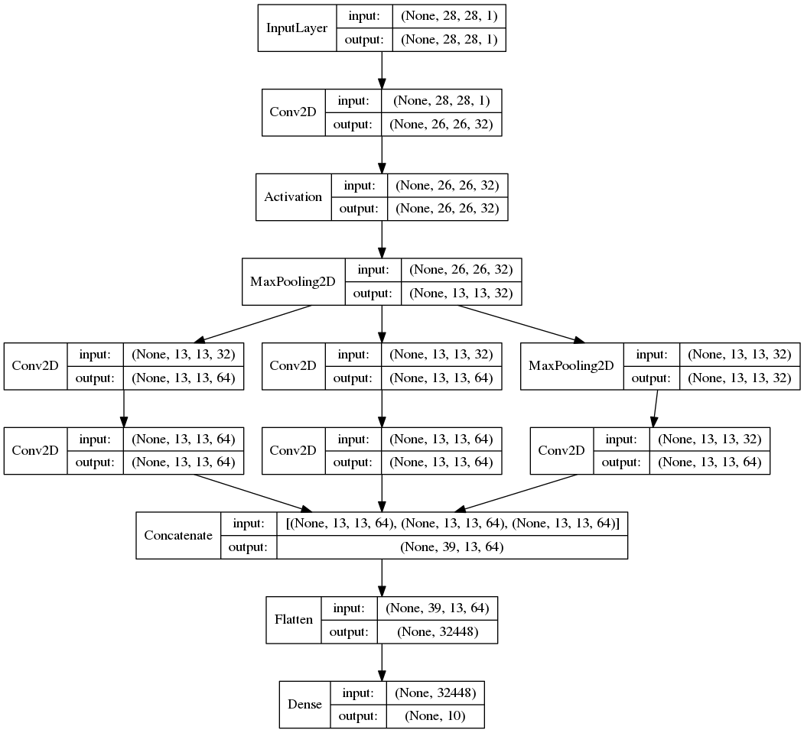
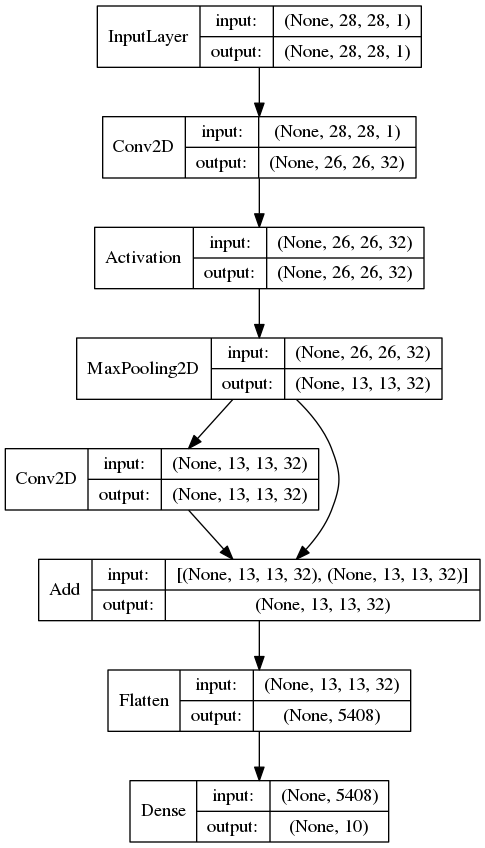

## 4.3 Keras Functional APIによる実装

前章ではInceptionV3やResNetといった学習済みモデルの利用方法を学びました。KerasのAPIを使って独自にインセプション構造や、ショートカット接続といった仕組みをKeras上で実装するにはどうすれば良いのでしょうか。ここではインセプション構造やショートカット接続といった仕組みを実装する方法を取り上げます。

Kerasには2つのモデルの作り方があります。1つはこれまでに見てきたようなSequentialクラスを使う方法です。

```python
from keras.models import Sequential
from keras.layers import Dense

model = Sequential()
model.add(Dense(64, activation='relu', input_dim=(784)))
model.add(Dense(64, activation='relu'))
model.add(Dense(10, activation='softmax'))
model.compile(optimizer='sgd',
              loss='categorical_crossentropy', metrics=['accuracy'])
```

Sequentialモデルは定義したレイヤーを順に処理していきます。AlexNetやVGG16のようなシンプルなニューラルネットワークであればSequentialモデルで実装可能です。

もう1つはModelクラスを使う方法です。この方法はFunctional APIとも呼ばれます。

```python
from keras.layers import Input, Dense
from keras.models import Model

inputs = Input(shape=(784,))
x = Dense(64, activation='relu')(inputs)
x = Dense(64, activation='relu')(x)
predictions = Dense(10, activation='softmax')(x)

model = Model(inputs=inputs, outputs=predictions)
model.compile(optimizer='sgd',
              loss='categorical_crossentropy', metrics=['accuracy'])
```

これまでに利用してきたDenseクラスやActivationクラスといったレイヤークラスはPythonのcallableオブジェクトとして実装されています。そのため上記のように関数呼び出しを連鎖するようなコーデイングスタイルで実装できます。

> Kerasのレイヤークラス（InputクラスやDenseクラスやActivationなど）は呼び出し時の戻り値にテンソル（BackendがTensorFlowの場合はtf.Tensorオブジェクト）を返します。Modelクラスには入力となるテンソルと出力のテンソルは接続します。

Functional APIを使えばインセプション構造やショートカット接続など、複雑なモデルを実装することができます。また既存のモデルをベースに転移学習を行う場合にも利用します。

> 転移学習については後述します。

<div style="page-break-before:always"></div>

### callableオブジェクト

Pythonのcallableオブジェクトは次のような__call__メソッドを実装したクラスです。

```python
class MyObject:
    def __call__(self, *args, **kwargs):
        print("called");

my_obj =  MyObject()
my_obj()
print(callable(my_obj))
```

Pythonには組み込み関数callable()が用意されています。callable関数は引数がcallable（呼び出し可能）オブジェクトであればTrueを、そうでなければFalseを返します。

実行結果は次のようになります。

```
called
True
```

<div style="page-break-before:always"></div>

### （参考）インセプション構造の実装

Functional APIを使ってインセプション構造を実装してみましょう。次のプログラムはMNISTデータをインセプション構造で処理します。

```python
import keras
from keras.layers import Input, Dense, Conv2D, Activation
from keras.layers import MaxPooling2D, Flatten, Concatenate
from keras.models import Model
from keras.datasets import mnist
from keras.utils import to_categorical

(x_train, y_train), (x_test, y_test) = mnist.load_data()
x_train = x_train.astype('float32')
x_test = x_test.astype('float32')
x_train /= 255
x_test /= 255
x_train = x_train.reshape(60000, 28, 28, 1)
x_test = x_test.reshape(10000, 28, 28, 1)
y_train = to_categorical(y_train, 10)
y_test = to_categorical(y_test, 10)

inputs = Input(shape=(28, 28, 1))

x = Conv2D(32, kernel_size=(3, 3))(inputs)
x = Activation("relu")(x)
x = MaxPooling2D(pool_size=(2,2))(x)

tower_1 = Conv2D(64, (1, 1), padding='same', activation='relu')(x)
tower_1 = Conv2D(64, (3, 3), padding='same', activation='relu')(tower_1)
tower_2 = Conv2D(64, (1, 1), padding='same', activation='relu')(x)
tower_2 = Conv2D(64, (5, 5), padding='same', activation='relu')(tower_2)
tower_3 = MaxPooling2D((3, 3), strides=(1, 1), padding='same')(x)
tower_3 = Conv2D(64, (1, 1), padding='same', activation='relu')(tower_3)
x = Concatenate(axis=1)([tower_1, tower_2, tower_3])

x = Flatten()(x)
predictions = Dense(10, activation='softmax')(x)
model = Model(inputs=inputs, outputs=predictions)
model.compile(optimizer='rmsprop',
              loss='categorical_crossentropy',
              metrics=['accuracy'])

history = model.fit(x_train, y_train, validation_data=(x_test, y_test), epochs=10)
```

プログラムの実行結果は次のようになります。

<div style="page-break-before:always"></div>

```
Train on 60000 samples, validate on 10000 samples
...省略
Epoch 8/10
10s 160us/step - loss: 0.0483 - acc: 0.9861 - val_loss: 0.0558 - val_acc: 0.9834
Epoch 9/10
10s 160us/step - loss: 0.0473 - acc: 0.9869 - val_loss: 0.0538 - val_acc: 0.9835
Epoch 10/10
10s 160us/step - loss: 0.0461 - acc: 0.9876 - val_loss: 0.0539 - val_acc: 0.9839
```

Kerasのユーティリティを使ってモデルを可視化してみましょう。

```python
from keras.utils import plot_model

plot_model(model, to_file='model_my_inception.png',
          show_shapes=True, show_layer_names=False)
```

次のような結果が出力されるでしょう。



> KerasのConcatenateレイヤーによって
、3つの入力[(None, 13, 13, 64), (None, 13, 13, 64), (None, 13, 13, 64)]が連結されて(None, 39, 13, 64)となっているのがわかります。

<div style="page-break-before:always"></div>


### （参考）ショートカット接続の実装

Functional APIを使ってショートカット接続を実装してみましょう。次のプログラムはMNISTデータをショートカット接続を使って処理します。

> ショートカット接続はResNetで提案された手法です。ショートカット接続によって層の深いニューラルネットワークでも効率よく学習することができます。

```python
import keras
from keras.layers import Input, Dense, Conv2D, Activation
from keras.layers import MaxPooling2D, Flatten, Add
from keras.models import Model
from keras.datasets import mnist
from keras.utils import to_categorical

(x_train, y_train), (x_test, y_test) = mnist.load_data()
x_train = x_train.astype('float32')
x_test = x_test.astype('float32')
x_train /= 255
x_test /= 255
x_train = x_train.reshape(60000, 28, 28, 1)
x_test = x_test.reshape(10000, 28, 28, 1)
y_train = to_categorical(y_train, 10)
y_test = to_categorical(y_test, 10)

inputs = Input(shape=(28, 28, 1))

x = Conv2D(32, kernel_size=(3, 3))(inputs)
x = Activation("relu")(x)
x = MaxPooling2D(pool_size=(2,2))(x)

y = Conv2D(32, kernel_size=(3, 3), padding='same')(x)
x = Add()([x, y])

x = Flatten()(x)
predictions = Dense(10, activation='softmax')(x)

model = Model(inputs=inputs, outputs=predictions)
model.compile(optimizer='rmsprop',
              loss='categorical_crossentropy',
              metrics=['accuracy'])

history = model.fit(x_train, y_train, validation_data=(x_test, y_test), epochs=10)
```

プログラムの実行結果はつぎのようになります。

<div style="page-break-before:always"></div>


```
Train on 60000 samples, validate on 10000 samples
...省略
Epoch 8/10
12s 201us/step - loss: 0.0315 - acc: 0.9903 - val_loss: 0.0501 - val_acc: 0.9853
Epoch 9/10
12s 200us/step - loss: 0.0290 - acc: 0.9917 - val_loss: 0.0544 - val_acc: 0.9851
Epoch 10/10
12s 201us/step - loss: 0.0264 - acc: 0.9920 - val_loss: 0.0573 - val_acc: 0.9846
```

Kerasのユーティリティを使ってモデルを可視化してみましょう。

```python
from keras.utils import plot_model

plot_model(model, to_file='model_my_resnet.png',
          show_shapes=True, show_layer_names=False)
```

次のような結果が出力されるでしょう。



> KerasのAddレイヤーによって2つの入力値[(None, 13, 13, 32), (None, 13, 13, 32)]が加算されます。加算のため出力シェイプは(None, 13, 13, 32)のままとなります。
