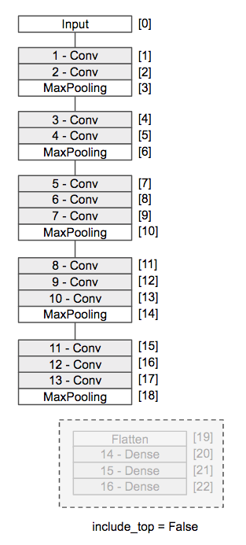
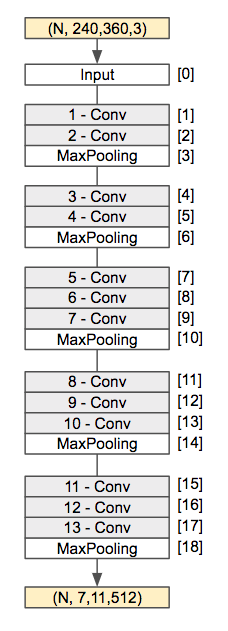
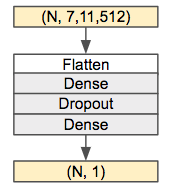

## 4.4 転移学習 - 特徴抽出器

学習済みのモデルの重みパラメータを別のニューラルネットワークにコピーして再学習することができます。たとえばImageNetのデータセットを学習したVGG16モデルの重みパラメータを活用して、あらたなニューラルネットワークとして再学習することができます。このような学習方法を転移学習と呼びます。転移学習によって既存の重みパラメータを再利用することで、少量のデータであっても効率よく学習することができます。

以降は学習済みのVGG16モデルを利用して、以下の2つの技法を学びます。

+ 特徴抽出器
+ ファインチューニング

<div style="page-break-before:always"></div>

### 特徴抽出器

VGG16モデルはトップレイヤー（出力層側にある3つの全結合層）を切り離して利用することができます。



この場合、入力層から学習済みの畳み込み層のみを使うことになり、入力画像データに対して特徴ベクトルを出力する特徴抽出器として利用することができます。

<div style="page-break-before:always"></div>


```python
from keras.applications.vgg16 import VGG16
from keras.preprocessing import image
from keras.applications.vgg16 import preprocess_input
import numpy as np

model = VGG16(weights='imagenet', include_top=False)

img_path = 'banana1.jpg'
img = image.load_img(img_path, target_size=(224, 224))
x = image.img_to_array(img)
x = np.expand_dims(x, axis=0)
x = preprocess_input(x)

features = model.predict(x)

print(x.shape)
print(features.shape)
```

プログラムを実行すると次のように出力されるでしょう。

```python
(1, 224, 224, 3)
(1, 7, 7, 512)
```

> ここでは訓練を行なわずにpredictメソッドを使用している点を確認しておきましょう。VGG16を推論用途に利用しています。

<div style="page-break-before:always"></div>

VGG16を特徴抽出器として利用すると、入力データは(224, 224, 3)だったのに対し、出力データは（7, 7, 512）に置き換わっているのがわかります。


> 224 * 224 * 3 = 150528次元のベクトルであった入力データが、特徴抽出器によって、7 * 7 * 512 = 25088次元のベクトルに変換されています。

抽出した特徴量を保存しておくことで、あらたなニューラルネットワークの入力データとしてことができます。

<div style="page-break-before:always"></div>


### VGG16 - 特徴抽出器の実践

それではVGG16を特徴抽出器として利用してみましょう。

ここでは前提として以下のとおり学習用データが存在するものとします。

+ 対象画像はA or Bの2種類（2値分類）とする
+ 画像サイズは縦：240px 横：360pxとする
+ data240x360/trainフォルダには864件の訓練データ
+ data240x360/testフォルダには700件のテストデータ

まずはVGG16を使って入力データの特徴を抽出します。

```python
import numpy as np
from keras.preprocessing.image import ImageDataGenerator
from keras.applications.vgg16 import VGG16

model = VGG16(include_top=False, weights='imagenet')

train_datagen = ImageDataGenerator(rescale=1.0 / 255)
train_generator = train_datagen.flow_from_directory('data240x360/train',
                                                      target_size=(240, 360),
                                                      batch_size=32,
                                                      class_mode=None,
                                                      shuffle=False)
bottleneck_features_train = model.predict_generator(train_generator,
                                                    train_generator.samples / 32)
print(bottleneck_features_train.shape)
np.save(open('bottleneck_features_train.npy', 'wb'), bottleneck_features_train)

test_datagen = ImageDataGenerator(rescale=1. / 255)
test_generator = test_datagen.flow_from_directory('data240x360/test',
                                                    target_size=(240, 360),
                                                    batch_size=32,
                                                    class_mode=None,
                                                    shuffle=False)

bottleneck_features_test = model.predict_generator(test_generator,
                                                    test_generator.samples / 32)
print(bottleneck_features_test.shape)
np.save(open('bottleneck_features_test.npy', 'wb'), bottleneck_features_test)
```

プログラムの実行結果は次のようになるでしょう。

<div style="page-break-before:always"></div>


```
Found 864 images belonging to 2 classes.
(864, 7, 11, 512)
Found 700 images belonging to 2 classes.
(700, 7, 11, 512)
```

> ここでは訓練を行なわずに特徴を抽出しています。



またカレントフォルダに以下の2つのファイルが生成されているのがわかります。

+ bottleneck_features_train.npy
  + 訓練データの特徴
+ bottleneck_features_test.npy
  + テストデータの特徴

<div style="page-break-before:always"></div>

プログラムの詳細を見てみましょう。

まずはVGG16インスタンスの生成時にinclude_topオプションにFalseを指定しています。

```python
model = VGG16(include_top=False, weights='imagenet')
```

これにより、VGG16上のトップレイヤー（出力層側にある3つの全結合層）を切り離して、特徴抽出器として利用できるようになります。

次にImageDataGeneratorを使って、フォルダ上の訓練データを扱うジェネレータを作成しています。

```python
train_datagen = ImageDataGenerator(rescale=1. / 255)
train_generator = train_datagen.flow_from_directory('data240x360/train',
                                                      target_size=(240, 360),
                                                      batch_size=32,
                                                      class_mode=None,
                                                      shuffle=False)
bottleneck_features_train = model.predict_generator(train_generator,
                                                    train_generator.samples / 32)
```

このときflow_from_directoryメソッドのclass_modeにはNoneを指定しています。直後の処理でfitメソッドではなく、predict_generatorメソッドを利用するのでラベルデータ（解答）は不要となるのでNoneを指定します。また引数のshuffleオプションにFlaseを指定することでデータをシャッフルしないようにしています。

<div style="page-break-before:always"></div>

### 異なるニューラルネットワークの学習

次に抽出した特徴を入力データとして、次のようなニューラルネットワークを学習してみましょう。



プログラムは次のようになります。

```python
import numpy as np
from keras.models import Model
from keras.layers import  Input, Dropout, Flatten, Dense

x_train = np.load(open('bottleneck_features_train.npy', "rb"))
y_train = np.array([0] *( x_train.shape[0] // 2) + [1] * (x_train.shape[0] // 2))

x_test = np.load(open('bottleneck_features_test.npy', "rb"))
y_test = np.array([0] * (x_test.shape[0] // 2) + [1] * (x_test.shape[0] // 2))

inputs = Input(shape=x_train.shape[1:])
x = Flatten()(inputs)
x = Dense(256, activation='relu')(x)
x = Dropout(0.5)(x)
outputs = Dense(1, activation='sigmoid')(x)
model = Model(inputs=inputs, outputs=outputs)

model.compile(optimizer='adadelta', loss='binary_crossentropy',
              metrics=['accuracy'])

history = model.fit(x_train, y_train, epochs=10, batch_size=32,
                    validation_data=(x_test, y_test))
```

プログラムの実行結果は次のようになるでしょう。

```
Train on 864 samples, validate on 700 samples
Epoch 1/10
1s 1ms/step - loss: 0.9053 - acc: 0.6528 - val_loss: 0.3980 - val_acc: 0.8314
Epoch 2/10
1s 743us/step - loss: 0.4255 - acc: 0.8229 - val_loss: 0.3329 - val_acc: 0.8643
Epoch 3/10
1s 737us/step - loss: 0.2854 - acc: 0.8831 - val_loss: 0.3012 - val_acc: 0.8757
Epoch 4/10
1s 739us/step - loss: 0.2431 - acc: 0.8993 - val_loss: 0.2605 - val_acc: 0.9043
Epoch 5/10
1s 739us/step - loss: 0.1836 - acc: 0.9213 - val_loss: 0.3758 - val_acc: 0.8129
Epoch 6/10
1s 735us/step - loss: 0.1635 - acc: 0.9514 - val_loss: 0.3725 - val_acc: 0.8314
Epoch 7/10
1s 741us/step - loss: 0.1277 - acc: 0.9549 - val_loss: 0.2329 - val_acc: 0.9043
Epoch 8/10
1s 741us/step - loss: 0.1396 - acc: 0.9491 - val_loss: 0.2266 - val_acc: 0.9043
Epoch 9/10
1s 742us/step - loss: 0.0963 - acc: 0.9699 - val_loss: 0.2785 - val_acc: 0.8871
Epoch 10/10
1s 745us/step - loss: 0.0910 - acc: 0.9676 - val_loss: 0.2416 - val_acc: 0.9086
```

抽出した特徴から上手く学習できているのがわかります。

> 特徴抽出器をデータの前処理として利用しているので、学習時間も短時間で済みます。


<div style="page-break-before:always"></div>

プログラムの詳細を見てみましょう。

まずはnumpyを使って事前に抽出した特徴をロードしています。

```python
x_train = np.load(open('bottleneck_features_train.npy', "rb"))
y_train = np.array([0] *( x_train.shape[0] // 2) + [1] * (x_train.shape[0] // 2))
```

> ラベルデータ（y_train）については、訓練データの先頭半分（350件）を[0]、後ろ半分（350件）を[1]とラベルを設定しています。特徴抽出時にシャッフルせずにデータをロードしたため、このような簡易な実装としています。

その後はFunctional APIを使って新たな学習モデルを構築しています。

```python
inputs = Input(shape=x_train.shape[1:])
x = Flatten()(inputs)
x = Dense(256, activation='relu')(x)
x = Dropout(0.5)(x)
outputs = Dense(1, activation='sigmoid')(x)
model = Model(inputs=inputs, outputs=outputs)
```

> 入力層は特徴データのシェイプに合わせて定義してます。
