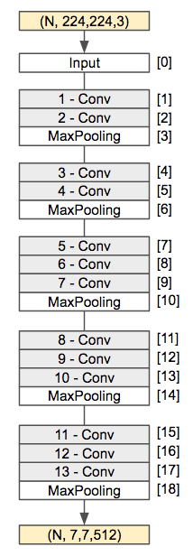
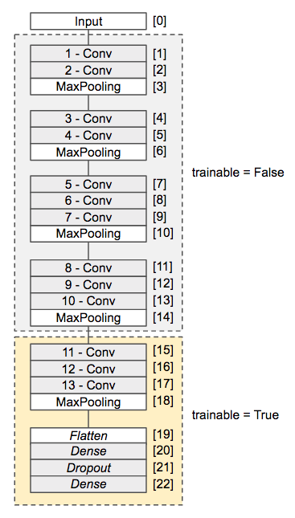
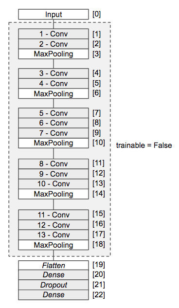

## 4.5 転移学習 - ファインチューニング

学習済みのVGG16を再利用する方法を引き続き見ていきましょう。前章の特徴抽出器は、学習済みのVGG16のトップレイヤー（出力層側にある3つの全結合層）を除いた畳み込み層を再利用するものでした。



これはVGG16の畳み込み層の学習済みのパラメータを再利用して、入力した画像ファイルの特徴を抽出するものでした。そのためVGG16モデルそのものを訓練することは行いませんでした。

次に学習するファインチューニングは、既存のモデルの持つレイヤーの一部を再学習させる方法です。既存の学習済みパラメータを再利用しつつ、独自のデータセットに合わせて、既存のレイヤーの持つ重みパラメータを調整していくことができます。

<div style="page-break-before:always"></div>

### VGG16 - ファインチューニングの実践

それではVGG16を畳み込み層の一部を再学習させてみましょう。ここでは次のように出力層側の畳み込み層を再学習させるものとします。また既存のトップレイヤーは使わず、用途に合わせてトップレイヤーを再実装しています。



次のようにプログラムを作成します。

<div style="page-break-before:always"></div>

```python
from keras.models import Model
from keras.layers import Flatten, Dense, Dropout
from keras.preprocessing.image import ImageDataGenerator
from keras.applications.vgg16 import VGG16
from keras.layers import Input
from keras.optimizers import SGD
from keras.datasets import cifar10
from keras.utils import to_categorical

base_model = VGG16(weights='imagenet',
                   include_top=False,
                   input_tensor=Input(shape=(240, 360, 3)))

for layer in base_model.layers[:15]:
    layer.trainable = False

x = base_model.output
x = Flatten()(x)
x = Dense(256, activation='relu')(x)
x = Dropout(0.5)(x)
outputs = Dense(1, activation='sigmoid')(x)

model = Model(inputs=base_model.input, outputs=outputs)
model.compile(optimizer='sgd', loss='binary_crossentropy', metrics=['acc'])

train_datagen = ImageDataGenerator(rescale=1.0/255,
                                   width_shift_range=0.3,
                                   rotation_range=30,
                                   zoom_range=0.3,
                                   horizontal_flip=True,
                                   vertical_flip=True)

train_generator = train_datagen.flow_from_directory('data240x360/train',
                                                    target_size=(240, 360),
                                                    batch_size=32,
                                                    class_mode='binary')

test_datagen = ImageDataGenerator(rescale=1.0/255)

test_generator = test_datagen.flow_from_directory('data240x360/test',
                                                        target_size=(240, 360),
                                                        batch_size=32,
                                                        class_mode='binary')

history = model.fit_generator(train_generator,
                    validation_data=test_generator,
                    steps_per_epoch=train_generator.samples / 32,
                    validation_steps=test_generator.samples / 32,
                    epochs=10)
```

プログラムを実行すると次のように出力されるでしょう。

```
Found 864 images belonging to 2 classes.
Found 700 images belonging to 2 classes.
Epoch 1/10
45s 2s/step - loss: 0.9696 - acc: 0.5255 - val_loss: 0.6775 - val_acc: 0.6171
Epoch 2/10
44s 2s/step - loss: 0.6770 - acc: 0.5845 - val_loss: 0.6532 - val_acc: 0.6314
Epoch 3/10
44s 2s/step - loss: 0.6331 - acc: 0.6435 - val_loss: 0.5285 - val_acc: 0.7457
Epoch 4/10
45s 2s/step - loss: 0.5251 - acc: 0.7500 - val_loss: 0.3389 - val_acc: 0.8743
Epoch 5/10
45s 2s/step - loss: 0.5065 - acc: 0.7708 - val_loss: 0.3120 - val_acc: 0.8957
Epoch 6/10
45s 2s/step - loss: 0.3910 - acc: 0.8287 - val_loss: 0.2503 - val_acc: 0.9214
Epoch 7/10
45s 2s/step - loss: 0.3822 - acc: 0.8507 - val_loss: 0.2285 - val_acc: 0.9086
Epoch 8/10
45s 2s/step - loss: 0.3461 - acc: 0.8507 - val_loss: 0.2082 - val_acc: 0.9286
Epoch 9/10
45s 2s/step - loss: 0.3019 - acc: 0.8692 - val_loss: 0.2009 - val_acc: 0.9229
Epoch 10/10
45s 2s/step - loss: 0.2948 - acc: 0.8924 - val_loss: 0.2194 - val_acc: 0.9286
```

これまでに比べて最も高い93%近い正答率となっています。

> ここでは240x360サイズをサンプルにしていますが、以前に利用した60x90サイズの画像で検証した場合も90%程度の結果を確認できるでしょう。

<div style="page-break-before:always"></div>

プログラムの詳細を見てみましょう。

まずはVGG16モデルを生成しています。

```python
base_model = VGG16(weights='imagenet',
                   include_top=False,
                   input_tensor=Input(shape=(240, 360, 3)))
```

このときweights='imagenet'を指定することでImageNetで学習済みのパラメータをロードし、include_top=Falseを指定することでトップレイヤー（出力層側にある3つの全結合層）を読み込まないようにしています。またinput_tensor=Input(shape=(240, 360, 3)を指定することで入力層で受け取る画像のシェイプを240x360（3チャネル）としています。

次に生成した既存のVGG16モデルのレイヤー（0-14レイヤーまで）に対して、重みパラメータを学習しないように設定しています。

```python
for layer in base_model.layers[:15]:
    layer.trainable = False
```

上記のようにレイヤーオブジェクトのtrainableプロパティにFalseを代入することで、重みパラメータの学習を無効にすることができます。これにより15層目の畳み込みレイヤーのみ重みパラメータを学習することができます。

以降は2値分類を行うためのトップレイヤーを実装しています。

```python
x = base_model.output
x = Flatten()(x)
x = Dense(256, activation='relu')(x)
x = Dropout(0.5)(x)
outputs = Dense(1, activation='sigmoid')(x)
```

最後にVGG16モデルにトップレイヤーを結合します。

```python
model = Model(inputs=base_model.input, outputs=outputs)
model.compile(optimizer='sgd', loss='binary_crossentropy', metrics=['acc'])
```
<div style="page-break-before:always"></div>

### （参考）特徴抽出器としての実装

VGG16の既存の畳み込みレイヤーの学習を停止すれば、前章のようにVGG16を特徴抽出器として利用できます。

```python
for layer in base_model.layers:
    layer.trainable = False
```



この場合、既存の畳み込み層を活用した特徴の抽出と再実装したトップレイヤーの訓練を合わせて行うことになります。
